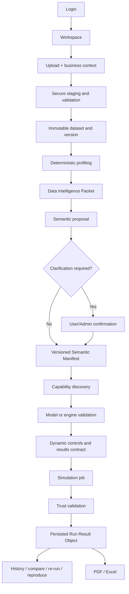
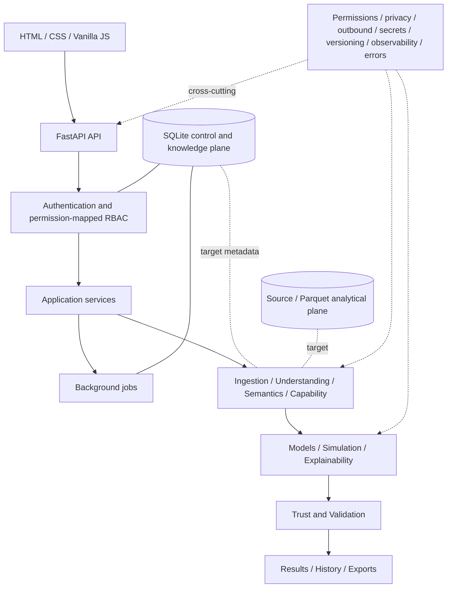

# Intelligent Predictive Simulation Platform (IPSP)

**Initial experience:** CampaignSim — Powered by IPSP  
**Target specification:** v1.0

**Current accepted implementation:** Phase 1 / v0.1.0 foundation — **FORMALLY ACCEPTED** (independent Phase 1L.1 final review: **PASS**)

**Next milestone:** v0.2.0 ingestion/storage/provenance — **AUTHORIZED, NOT STARTED**

IPSP is a local-first, dataset-agnostic platform intended to turn previously unseen structured business data into evidence-backed analytical, predictive, and simulation capabilities. Instead of forcing every dataset into a fixed schema or preselected model, IPSP is designed to profile the data, establish its meaning and relationships, ask focused questions where evidence is insufficient, validate what the data can responsibly support, and build the user experience from those validated capabilities. The current v0.1.0 release is the secure application foundation for that target product; it does not yet ingest or model datasets.

> **Status boundary:** Sections labeled **Implemented now — v0.1.0** describe production code that exists in this repository. Sections labeled **Target v1.0 architecture** describe frozen specifications and planned milestones, not current runtime functionality.

## The problem IPSP solves

Most analytics and simulation applications assume a known schema, fixed KPIs, predetermined controls, and one domain story. That approach breaks when a new dataset uses different grain, units, time semantics, identifiers, relationships, missing-value conventions, outcome definitions, or business rules. It can also create unsafe behavior: multiplying measures through a join, treating post-outcome fields as predictors, inventing a KPI definition, exposing an identifier as a scenario control, or presenting association as causation.

IPSP starts from a different question:

> Rather than asking “how do we make this dataset fit a simulator?”, IPSP asks “what can this dataset responsibly support?”

The target product is useful when teams have structured data but do not yet have a trustworthy analytical contract. It is designed to discover semantics and capabilities from evidence, support safe modelling and simulation only after validation, refuse unsupported requests with reasons, and make every accepted result repeatable and governed. A previously unseen dataset should not require benchmark-specific production code.

## Product definition and non-goals

The target lifecycle is:

```text
DATA → UNDERSTANDING → SEMANTIC CONTRACT → CAPABILITY DISCOVERY
     → MODEL VALIDATION → DYNAMIC UI → SIMULATION → TRUST GATE
     → RESULTS / HISTORY / EXPORT
```

IPSP v1.0 focuses on structured/tabular inputs: CSV/TSV, XLSX, Parquet, JSON/JSONL, and supported archives containing those formats. It is not:

- a universal document, image, audio, or unstructured-corpus AI system;
- a marketing-specific simulator—CampaignSim is the initial experience and visual identity only;
- a guarantee of causal inference from observational data;
- an autonomous system that invents or executes arbitrary joins without grain/cardinality checks;
- a system that lets an LLM execute generated code against raw datasets;
- a system where LLM prose becomes truth without schemas, deterministic evidence, and validation.

The frozen product boundary is defined in [Scope Freeze](docs/00_SCOPE_FREEZE.md), [Project Specification](docs/01_PROJECT_SPEC.md), and [Product Requirements](docs/02_PRODUCT_REQUIREMENTS.md).

## Current implementation versus target v1.0

This table is the quickest way to distinguish repository reality from roadmap design.

| Area | v0.1.0 status | Target v1.0 | Deep dive |
|---|---|---|---|
| Foundation/runtime | **Implemented:** Python 3.11+, FastAPI factory, typed settings, safe errors, offline static application | Portable local-first application foundation for all engines | [Architecture](docs/03_ARCHITECTURE.md) |
| Authentication/RBAC | **Implemented:** users, roles, 13 permissions, Argon2id, opaque sessions, CSRF, lockout, bootstrap | Dataset/project/column-aware authorization and administration | [Security/RBAC](docs/18_SECURITY_RBAC_SPEC.md) |
| Jobs | **Implemented:** persistent generic jobs and single-process daemon workers | Provider abstraction capable of later distributed execution | [Jobs](docs/24_JOB_PROCESSING_SPEC.md) |
| Observability/audit | **Implemented:** structured rotating JSONL logs, trace/request/session correlation, durable audit events | Trace all data, ML, LLM, simulation, export, and security operations | [Observability](docs/22_OBSERVABILITY_AUDIT_SPEC.md) |
| Health | **Implemented:** liveness, readiness, authorized rich diagnostics | Diagnostics spanning storage, engines, providers, models, and backup | [System Health](docs/37_SYSTEM_HEALTH_SPEC.md) |
| Frontend shell | **Implemented:** Login, Overview, Jobs, Profile, System Health; System/Dark/Light themes | Full metadata-driven dataset and simulation workspace | [UI/UX](docs/05_UI_UX_SPEC.md) |
| Ingestion/storage | **Not implemented** | Secure staging, validation, immutable originals, canonical Parquet, version metadata | [Ingestion](docs/20_INGESTION_STORAGE_SPEC.md) |
| Data understanding | **Not implemented** | Deterministic profiles, grain/role/time/unit/sensitivity evidence | [Data Understanding](docs/07_DATA_UNDERSTANDING_SPEC.md) |
| Semantics | **Not implemented** | Versioned Dataset Semantic Manifest plus clarification workflow | [Semantic Model](docs/08_SEMANTIC_MODEL_SPEC.md) |
| Relationships/lineage | **Not implemented** | Structural, temporal, hierarchy, dependency, lineage, and join-safety analysis | [Relationships](docs/09_RELATIONSHIPS_HIERARCHY_LINEAGE_SPEC.md) |
| Capability discovery | **Not implemented** | Discover, validate, enable, limit, disable, or refuse capabilities | [Capabilities](docs/11_CAPABILITY_DISCOVERY_SPEC.md) |
| Modelling/model registry | **Not implemented** | Baselines, candidate routing, leakage-safe validation, champion/challenger registry | [Modelling](docs/12_MODELING_ENGINE_SPEC.md) |
| Simulation | **Not implemented** | Predictive, deterministic, benchmark, Monte Carlo, and synthetic-context scenarios | [Simulation](docs/14_SIMULATION_ENGINE_SPEC.md) |
| Trust | **Not implemented** | Independent data/semantic/model/support/constraint/privacy validation | [Trust](docs/15_TRUST_AND_VALIDATION_SPEC.md) |
| LLM | **Policy/provider boundaries only; no LLM execution** | Optional ML-only, local, remote, and hybrid semantic assistance | [LLM Architecture](docs/16_LLM_ARCHITECTURE.md) |
| History/reproducibility | **Not implemented** | Re-run, exact reproduce, compare, immutable lineage, seeds/configuration | [History](docs/26_SIMULATION_HISTORY_REPRODUCIBILITY.md) |
| Reports/exports | **Not implemented** | PDF and Excel from persisted Run Result Objects | [Reporting](docs/25_REPORTING_EXPORT_SPEC.md) |
| Backup/restore | **Health reports `never_run`; execution not implemented** | Audited, checksum-validated manual backup and restore | [Backup/Recovery](docs/36_BACKUP_RETENTION_RECOVERY.md) |

## End-to-end target lifecycle

The full product lifecycle is planned as one evidence-preserving chain:



See [End-to-End Lifecycle](flows/20_END_TO_END_LIFECYCLE.md) and [Dataset Onboarding](flows/02_DATASET_ONBOARDING.md). Everything from upload onward is target functionality scheduled after v0.1.0.

## Architecture overview

The locked architecture separates presentation, application services, data intelligence, quantitative engines, independent validation, and durable results:



FastAPI routers own HTTP concerns and remain thin. Services own policy and workflows, repositories own database access, SQLAlchemy models have one canonical home, and Pydantic models define API/provider contracts. Cross-cutting controls—permissions, privacy, outbound policy, secrets, versioning, background jobs, structured events, trace IDs, and safe error envelopes—apply across engine boundaries. See [System Architecture](docs/03_ARCHITECTURE.md) and [Architecture Flow](flows/01_SYSTEM_ARCHITECTURE.md).

## Storage architecture

### SQLite control/knowledge plane

SQLite is the local control plane, not the warehouse for millions of analytical rows. In v0.1.0 it stores security identities and mappings, hashed session state, generic jobs, and durable audit events. The target schema extends it with project/dataset/version metadata, semantic manifests, capabilities, model registry records, run lineage, policies, configuration references, and backup metadata.

### Source/Parquet analytical plane

The target analytical plane preserves immutable source uploads and canonical, versioned Parquet or source-backed analytical views. Profiling, training, and simulation operate from these references rather than copying full analytical datasets into SQLite. Multi-table data is not flattened by default; materialized views require a validated join plan and known output grain.

This division keeps local governance simple while allowing columnar analytical workloads to scale. See [Storage Planes](flows/12_STORAGE_PLANES.md), [Ingestion and Storage](docs/20_INGESTION_STORAGE_SPEC.md), and [SQLite Schema](docs/27_SQLITE_SCHEMA_SPEC.md).

## Dataset onboarding and versioning — target v0.2+

The planned onboarding pipeline performs authorization, size/type allowlisting, generated internal naming, signature/MIME checks where practical, archive traversal defense, staging or quarantine, parser validation, canonicalization, immutable original preservation, checksum capture, and metadata registration.

A logical dataset has immutable versions. Each version records its source artifact, checksum, source format, table/sheet structure, provenance, and canonical analytical references. CSV/TSV, XLSX, Parquet, JSON/JSONL, and ZIP containers of supported files are the v1.0 target formats. A workbook may contain several tables plus narrative; actual tabular regions must be detected, and commentary must not silently become records. Multi-table metadata preserves per-table grain and validated relationships rather than flattening everything by default.

Sampling provenance distinguishes full data, random or stratified samples, time-window samples, filtered subsets, aggregated extracts, and unknown provenance. A small sample can reveal schema and semantic candidates without proving population balance, seasonality, or model sufficiency. See [Sampling and Provenance](docs/21_SAMPLING_PROVENANCE_SPEC.md).

## Data Understanding Engine — target v0.3+

Deterministic profiling comes before semantic or LLM interpretation. The target evidence packet includes:

- physical and logical types, null/blank/sentinel behavior, cardinality, uniqueness, distributions, quantiles, outliers, date coverage, gaps, and minimal examples;
- candidate grain, identifiers, entities, keys, dimensions, measures, targets, controls, context, time, units/currencies, and sensitive or quasi-identifying fields;
- correlations or rank associations where meaningful, mutual information, categorical association, and functional-dependency candidates;
- key/foreign-key and hierarchy proposals, temporal ordering, semantic redundancy, and feature lineage;
- join cardinality and multiplication risk, observation maturity, prediction-horizon availability, and leakage candidates.

Names are only one evidence source. IPSP must combine values, distributions, descriptions, related fields, temporal availability, lineage, and confirmations; it must never rely on a column name alone. The profiler produces a compact Data Intelligence Packet for rules and optional LLM review, not a wholesale copy of the raw dataset. See [Data Understanding](docs/07_DATA_UNDERSTANDING_SPEC.md) and [Data Intelligence Packet](flows/03_DATA_INTELLIGENCE_PACKET.md).

## Semantic Model Engine — target v0.4+

The Dataset Semantic Manifest is the versioned contract consumed downstream. It can describe entities, identifiers, dimensions, measure families, targets, controllable inputs, non-controllable context, time and calendars, events, states, hierarchies, relationships, KPIs, derived measures, constraints, attribution rules, provenance, sensitivity, lineage, and availability relative to a prediction horizon.

Semantic conclusions combine deterministic evidence, supplied descriptions, relationship consistency, prior confirmed metadata, and optional structured LLM proposals. Raw LLM confidence is never final confidence. When descriptions and data behavior conflict, IPSP creates a conflict and asks a targeted question; it does not silently reconcile them. Confirmed answers and evidence produce a new manifest version. See [Semantic Model](docs/08_SEMANTIC_MODEL_SPEC.md) and [Semantic Clarification](flows/04_SEMANTIC_CLARIFICATION.md).

## Relationships, hierarchy, lineage, and KPI dependency — target v0.3–v0.4

IPSP distinguishes structural one-to-one/one-to-many/many-to-many relationships, exact or normalized identity links, temporal joins, ordered journeys, lifecycle/state transitions, measure dependencies, plan-versus-actual relationships, commercial flows, strict/soft hierarchies, and cross-classifications.

Every proposed multi-table analytical view must establish key cardinality, output grain, and which measures would multiply. Unsafe direct aggregation is blocked or transformed to the correct grain. Ordered journeys are measurement-aware and are not forced into a monotonic funnel when units, cohorting, or re-entry semantics do not support it.

Feature lineage records derivation, binning, transformation, aggregation, canonicalization, and redundant representations. KPI definitions form a validated dependency graph with approved fields/functions, unit compatibility, explicit filters/states, safe division, and evidence that formulas match stored derived values where applicable. See [Relationships, Hierarchy and Lineage](docs/09_RELATIONSHIPS_HIERARCHY_LINEAGE_SPEC.md), [KPI Dependency](docs/10_KPI_METRIC_DEPENDENCY_SPEC.md), and [Relationship Discovery](flows/05_RELATIONSHIP_DISCOVERY.md).

## Capability Discovery — target v0.5

Capability discovery asks: **What can responsibly be calculated, diagnosed, predicted, simulated, explained, or refused?** Candidate families include descriptive and diagnostic analysis, regression, classification, count prediction, forecasting, similarity/look-alike, carefully qualified propensity, clustering/segment profiling, deterministic what-if, benchmark scenarios, sensitivity analysis, Monte Carlo uncertainty, synthetic context, journey simulation, and risk/anomaly analysis.

Every candidate passes four gates:

1. **Semantic gate:** the concept is meaningful and temporal roles are valid.
2. **Data gate:** required fields, variation, labels, support, and grain exist.
3. **Model/engine gate:** baseline comparison or deterministic validation is acceptable.
4. **Trust gate:** support, extrapolation, constraints, privacy, and lineage checks pass.

The lifecycle is `DISCOVERED → VALIDATING → VALIDATED → ENABLED`, with `LIMITED`, `DISABLED`, or `BLOCKED` outcomes carrying reason codes. Refusing unsupported ROI, causal lift, optimization, individual propensity, or other requests is a feature, not a failure. See [Capability Discovery](docs/11_CAPABILITY_DISCOVERY_SPEC.md) and its [flow](flows/06_CAPABILITY_DISCOVERY.md).

## Modelling and model lifecycle — target v0.5

Candidate routing follows target semantics and evidence: regression families for suitable numeric outcomes, classification for binary/multiclass labels, count-aware models where target semantics warrant them, forecasting with time-aware baselines and backtesting, and similarity/look-alike methods with sensitive-feature governance.

Every predictive path starts with a simple or naive baseline. Validation strategy follows the data: chronological splits, group/entity/geographic separation, standard holdout/cross-validation, or backtesting. Leakage checks exclude post-outcome fields, future/test aggregates, target-derived same-period personas, high-cardinality memorization, and duplicate derived concepts. A complex model that does not meaningfully justify itself over its baseline does not enable the capability.

The target registry records dataset, semantic, capability, feature, target, split, metric, artifact, version, seed, and parent/challenger lineage. Candidates move through `TRAINING`, `CANDIDATE`, `CHALLENGER`, `CHAMPION`, `REJECTED`, and `ARCHIVED`; controlled promotion and shadow evaluation replace silent self-rewriting. See [Modelling Engine](docs/12_MODELING_ENGINE_SPEC.md), [Model Registry](docs/13_MODEL_REGISTRY_LIFECYCLE_SPEC.md), and [Model Lifecycle](flows/07_MODEL_LIFECYCLE.md).

## Simulation engines — target v0.6

The target supports several engines when their gates pass:

- **Predictive ML scenario:** vary validated controls/context and score with a validated model; results describe predictive association, not causal effect.
- **Deterministic what-if:** evaluate confirmed KPI identities or business formulas without ML.
- **Benchmark scenario:** evaluate an explicit assumption that a segment reaches an approved reference level.
- **Monte Carlo:** propagate validated distribution or residual uncertainty and show intervals only when calibrated and meaningful.
- **Synthetic context:** use SDV where validated to generate plausible context; SDV does not determine outcomes, which remain governed by a validated response model or rule.

Only fields marked as controls—or explicitly permitted as user-defined assumptions—can become scenario controls. Identifiers, outcomes, post-outcome variables, and unsafe sensitive fields are excluded. Each run checks historical range, combination support, extrapolation, observation maturity, missing context, and confirmed constraints. See [Simulation Engine](docs/14_SIMULATION_ENGINE_SPEC.md) and [Simulation Execution](flows/08_SIMULATION_EXECUTION.md).

## Trust & Validation Engine — target v0.6

Trust is an independent product layer, not a confidence badge produced by the model or LLM it evaluates.

> **AI proposes. Evidence validates. Rules constrain. Models compete. Humans arbitrate exceptions. The system remembers the outcome.**

Trust synthesizes data quality, semantic confidence, model/engine validation, sample and historical support, drift/extrapolation, constraint compliance, and privacy/governance. It distinguishes:

1. intrinsic constraints that are mathematically unavoidable;
2. confirmed semantic constraints established from meaning;
3. explicit business/process constraints;
4. empirical expectations that normally warn rather than block.

Negative financial values are not universally invalid. They are blocked only when intrinsically impossible or contrary to a confirmed semantic/business rule; otherwise evidence determines whether they are valid observations or warnings.

Green permits continuation, Amber communicates limited evidence or review-worthy novelty, and Red blocks critical ambiguity, leakage, invalid models, unsupported capabilities, policy failures, or constraint violations. See [Trust and Validation](docs/15_TRUST_AND_VALIDATION_SPEC.md) and [Trust Flow](flows/09_TRUST_VALIDATION.md).

## ML versus LLM authority — target v0.8–v0.9

```text
ML/statistics = numerical and statistical authority
Local LLM     = optional semantic intelligence
Remote LLM    = optional policy-controlled escalation
```

The target modes are `ML_ONLY`, `LOCAL_LLM`, `REMOTE_LLM`, and `HYBRID_LLM`. Deterministic profiling and rules run first. When they are insufficient, a compact Data Intelligence Packet may be passed through a structured provider contract for schema classification, relationship proposals, clarification questions, KPI candidates, capability review, or human-facing explanations. Every operational response must validate against Pydantic/JSON schemas and deterministic evidence.

Raw datasets are never transmitted wholesale. Remote access requires feature availability, backend outbound permission, provider allowlisting, dataset/column classification, and an allowed transmission level. Restricted datasets default to local-only unless an Admin explicitly changes policy. See [LLM Architecture](docs/16_LLM_ARCHITECTURE.md), [Remote Privacy Policy](docs/17_PRIVACY_REMOTE_LLM_POLICY.md), [LLM Routing](flows/10_LLM_ROUTING.md), and [Remote Privacy Flow](flows/16_PRIVACY_REMOTE_LLM.md).

## Security, RBAC, privacy, and outbound policy

### Implemented now — v0.1.0

Authorization resolves from `User → Role → RolePermission → Permission`; role name alone grants nothing, and no persisted `is_admin` bypass exists. The built-in Admin and User roles are backed by these 13 canonical permissions:

| Domain | Permissions |
|---|---|
| Simulation | `simulation.run`, `simulation.export` |
| Dataset | `dataset.view`, `dataset.upload`, `dataset.configure`, `dataset.assign` |
| Models | `model.train`, `model.promote` |
| AI/outbound | `llm.configure`, `internet.configure` |
| Administration | `user.manage`, `logs.view`, `system.configure` |

The foundation implements Argon2id password hashing; privacy-preserving authentication failures; temporary failed-login lockout; opaque random server sessions; hash-only session and CSRF persistence; expiry, login rotation, logout/password/role-change invalidation; HttpOnly/Secure/SameSite cookies; session-bound CSRF for browser mutations; disabled-user enforcement; required-password-change behavior; and a one-time first-Admin CLI.

Secrets are referenced through `SecretProvider`; values are not ordinary Settings fields or SQLite configuration. The implemented provider reads explicitly requested environment entries into redacted values and fails closed when a required secret is missing. Internet, remote LLM, model download, update check, provider allowlisting, and transmission levels are enforced by a deny-by-default backend policy. A feature flag cannot bypass an outbound denial.

### Target v1.0

Project/dataset ACLs and column policies will govern view, simulation, export, modelling, and remote transmission after the dataset subsystem exists. They are specified but are not executable in v0.1.0. See [Security/RBAC](docs/18_SECURITY_RBAC_SPEC.md), [Outbound, Secrets and Configuration](docs/19_OUTBOUND_SECRETS_CONFIG_SPEC.md), and [Auth/RBAC Flow](flows/11_AUTH_RBAC.md).

## Background jobs

### Implemented now — v0.1.0

Jobs persist in SQLite before execution. Exact statuses are `QUEUED`, `RUNNING`, `SUCCEEDED`, `FAILED`, and `CANCELLED`. The nine generic job families are `UPLOAD_PROCESSING`, `PROFILING`, `RELATIONSHIP_ANALYSIS`, `MODEL_TRAINING`, `SYNTHETIC_FITTING`, `SIMULATION`, `REPORT_GENERATION`, `BACKUP`, and `RESTORE`; the enum defines durable orchestration vocabulary, not proof that every corresponding engine is implemented.

The owner-scoped API supports list, detail, cancel, and retry. Records contain progress, phase/message, timestamps, trace/request context, retryability, cancellation state, safe errors, and artifact references. The local backend provides cooperative cancellation, startup recovery, interrupted-job failure, bounded shutdown, and stale-worker authority revocation.

`LocalJobBackend` is deliberately a single-process execution provider. Do not run multiple active local worker processes against one SQLite control-plane database. A future provider may introduce leases and distributed coordination, but Redis and Celery are not present today. See [Job Processing](docs/24_JOB_PROCESSING_SPEC.md) and [Job State Flow](flows/15_BACKGROUND_JOBS.md).

## Observability, audit, errors, and health

### Implemented now — v0.1.0

Meaningful operations use structured event fields including `timestamp_utc`, `event_id`, `trace_id`, `request_id`, component, action, status, and severity. Context may add a non-secret `session_correlation_id`, user/resolved-role, duration, stable error code, and resource identifiers. High-volume runtime events go to console and a rotating UTF-8 JSONL file; durable audit/security events are selected into SQLite. SQLite is not used as a complete runtime-log warehouse.

Redaction excludes passwords, hashes, bearer tokens, cookies, CSRF values, authorization headers, API keys, request bodies, and unsafe exception data. Client errors use stable codes, safe messages, trace IDs, and recoverability hints while internal diagnostics remain in sanitized logs. Raw stack traces never appear in production API/UI responses.

Current health surfaces are intentionally separate:

- `GET /health/live` — minimal process-only liveness;
- `GET /health/ready` — safe readiness for application, configuration, database, foreign keys, migrations, runtime logs, and job worker; analytical storage is explicitly deferred;
- `GET /api/v1/admin/system/health` — sanitized rich diagnostics protected by `system.configure`.

Rich health performs no unapproved remote reachability probe and reports unimplemented or never-run capabilities honestly. See [Observability](docs/22_OBSERVABILITY_AUDIT_SPEC.md), [Error Handling](docs/23_ERROR_HANDLING_SPEC.md), [System Health](docs/37_SYSTEM_HEALTH_SPEC.md), and [Trace Flow](flows/13_OBSERVABILITY_TRACE.md).

## Results, history, and export — target v0.6+

The target Run Result Object persists the user/time, exact dataset/semantic/capability/model versions, baseline and scenario inputs, predictions, intervals, trust decomposition, warnings, explanations, historical support, seed, effective non-secret configuration, and artifact references.

History distinguishes **re-run**—the same scenario intent using the current eligible champion—from **reproduce**, which resolves the exact original versions, seed, and configuration. Results can be opened, compared, re-run, reproduced, and exported. PDF and Excel are generated from the persisted object, not by screenshotting the browser, and always enforce dataset/column policy. None of this is implemented in v0.1.0. See [Reporting and Export](docs/25_REPORTING_EXPORT_SPEC.md), [History and Reproducibility](docs/26_SIMULATION_HISTORY_REPRODUCIBILITY.md), and [Report Flow](flows/14_REPORT_EXPORT.md).

## UI/UX vision

### Implemented now — v0.1.0

The production frontend is static semantic HTML, modular CSS, and Vanilla JavaScript ES modules. It has no React, Vue, Angular, Svelte, Streamlit, npm build, public CDN, remote font, or runtime analytics dependency. CampaignSim — Powered by IPSP is the initial branding over a generic IPSP backend.

The responsive authenticated shell includes Login, forced password change, Overview, owner-visible Jobs, read-only Profile, authorized System Health, logout, safe loading/empty/error/permission states, keyboard/focus foundations, reduced-motion handling, print styles for Jobs and System Health, and System/Dark/Light semantic themes. Identity stays in memory; only theme preference uses localStorage; the browser does not read the HttpOnly session token.

### Target v0.7+

Dataset onboarding and simulation each become five-step workflows. Controls and results are derived from validated semantic/capability metadata—numeric range controls, categories, booleans, dates, hierarchies, assumptions, result cards, charts, and trust states—not fixed campaign fields. The supplied reference HTML contributes dark layered surfaces, indigo/violet accents, cards, stepper, metrics, alerts, progress, tabs, tables, and responsive patterns only; its demo KPIs, controls, model names, and behavior are not implementation authority.

See [UI/UX Specification](docs/05_UI_UX_SPEC.md), [Design System](docs/06_UI_DESIGN_SYSTEM.md), and [Reference Material](reference/README.md).

## Anti-contamination and benchmark strategy

Benchmarks test whether generic discovery works; they never define production schemas or branches. The seven benchmark families stress:

1. large aggregated panels and scale;
2. multi-table launch/order/unit grain and join multiplication;
3. event sequence, identity normalization, attribution, and qualified measures;
4. hospitality/customer-experience journeys, hierarchies, and narrative conflicts;
5. sales/finance measure families, fiscal time, inventory, sentinels, and valid negatives;
6. wide customer/household data, geography, sensitivity, look-alike, ambiguous labels, and units;
7. ecommerce experience/persona data, mixed-unit journeys, re-entry, clusters, leakage, and prediction horizons.

Benchmark source names, KPIs, fixed stages, model choices, controls, and output assumptions are prohibited from generic production logic. Benchmark knowledge belongs in fixtures, expected manifests, tests, or benchmark documentation. See [Benchmark Catalog](docs/39_BENCHMARK_CATALOG.md) and [Anti-Contamination Rules](docs/40_ANTI_CONTAMINATION.md).

## Technical stack

| Layer | Active in v0.1.0 | Target architecture—not yet installed/exercised unless added by its milestone |
|---|---|---|
| Runtime/API | Python 3.11+, FastAPI, Uvicorn, Pydantic | Same typed API/service direction |
| Control plane | SQLAlchemy 2.x, SQLite, Alembic | Portable repositories; PostgreSQL architecture-ready, not v1.0 runtime scope |
| Security | pwdlib with Argon2 | Dataset/column governance extensions |
| Analytical data | None | Polars, PyArrow, Parquet; Pandas where a library requires it; OpenPyXL for XLSX |
| Models/statistics | None | scikit-learn, LightGBM, CatBoost, Statsmodels, NumPy/SciPy, SHAP, Optuna |
| Synthetic context | None | SDV when capability validation permits it |
| Frontend | HTML/CSS/Vanilla JS ES modules, local assets | Locally vendored Plotly.js when dynamic charts require it |
| Quality | pytest, Ruff, mypy | Benchmark and full-product acceptance layers added by milestones |

Direct and resolved current dependencies are declared in [pyproject.toml](pyproject.toml) and [requirements.lock](requirements.lock). Target library names express architecture direction, not present functionality.

## Repository structure and ownership

```text
IPSP/
├── backend/ipsp/
│   ├── api/{routes,schemas,dependencies}/   # HTTP ownership and Pydantic contracts
│   ├── auth/ and security/                 # identity, RBAC, sessions, secrets, policy
│   ├── database/models/                    # sole SQLAlchemy ORM ownership
│   ├── repositories/ and services/         # persistence and application policy
│   ├── jobs/ and observability/            # local execution, traces, logs, audit
│   └── ingestion/.../trust/                # target engine packages, added by milestones
├── database/migrations/                    # sole Alembic history
├── frontend/                               # offline application shell and design system
├── tests/{unit,integration,security,architecture}/
├── docs/                                   # authoritative specifications and progress
├── flows/                                  # Mermaid behavior and architecture flows
├── prompts/                                # reviewed implementation/audit prompts
├── reference/                              # visual reference only
├── config/                                 # configuration guidance
├── AGENTS.md                               # repository-wide agent rules
└── FILE_INDEX.md                           # exhaustive documentation index
```

ORM entities live exactly once in `backend/ipsp/database/models/`; API schemas in `backend/ipsp/api/schemas/`; routes in `backend/ipsp/api/routes/`; migrations in `database/migrations/`; SQL/database work goes through repositories rather than being scattered through endpoints. Target engine directories are created only when their milestones begin. See [Project Structure](docs/04_PROJECT_STRUCTURE.md).

## Current API surface — implemented v0.1.0 only

| Method | Route | Purpose |
|---|---|---|
| GET | `/` | Static offline frontend |
| GET | `/api/v1` and `/api/v1/` | Safe foundation/browser bootstrap metadata |
| POST | `/api/v1/auth/login` | Authenticate and rotate an opaque session |
| GET | `/api/v1/auth/me` | Current safe identity |
| POST | `/api/v1/auth/logout` | CSRF-protected logout and invalidation |
| POST | `/api/v1/auth/change-password` | CSRF-protected password change and session invalidation |
| GET | `/api/v1/jobs` | Owner-scoped bounded job list |
| GET | `/api/v1/jobs/{job_id}` | Owner-scoped job detail |
| POST | `/api/v1/jobs/{job_id}/cancel` | Owner/CSRF-protected cancellation |
| POST | `/api/v1/jobs/{job_id}/retry` | Owner/CSRF-protected retry |
| GET | `/health/live` | Minimal liveness |
| GET | `/health/ready` | Minimal readiness |
| GET | `/api/v1/admin/system/health` | Permission-protected rich diagnostics |

Future `/projects`, `/datasets`, `/models`, `/simulations`, reports, AI configuration, policy, and logs families in [REST API Contract](docs/28_REST_API_CONTRACT.md) are architectural reservations, not registered v0.1.0 routes. FastAPI also exposes its standard OpenAPI/documentation endpoints in development unless deployment configuration changes them.

## Local development

Python 3.11 or newer is required. The commands below use PowerShell from the repository root.

```powershell
python -m venv .venv
.\.venv\Scripts\Activate.ps1
python -m pip install --upgrade pip
python -m pip install -e ".[dev]"
```

Apply the canonical migrations before starting an authenticated workspace:

```powershell
python -m alembic upgrade head
python -m alembic current
```

Create the first administrator against an empty, migrated database. The CLI reads passwords without echoing them and permanently refuses a second bootstrap once a user exists.

```powershell
ipsp-create-admin
```

For existing installations, `ipsp-sync-rbac` additively ensures the Admin/User roles, 13 core permissions, and missing Admin mappings without deleting custom catalog entries.

Authentication cookies are Secure by default, and production requires HTTPS. For plain-HTTP localhost development only:

```powershell
$env:IPSP_AUTH__COOKIE_SECURE = "false"
python -m uvicorn ipsp.main:create_app --factory --reload
```

Open `http://127.0.0.1:8000`. Never use the insecure-cookie override in production. The implemented UI/API foundation operates without Internet access.

Copy `.env.example` to a local ignored `.env` only when overrides are needed. Nested environment settings use `__`, such as `IPSP_OUTBOUND__INTERNET_ENABLED=false`. Secret values are separate process entries resolved through `SecretRef`, never ordinary Settings. See [Configuration](config/README.md).

For the exact locked environment:

```powershell
python -m pip install -r requirements.lock
python -m pip install -e . --no-deps
```

## Quality and testing

Testing is layered: unit contracts, integration/database/API behavior, security and privacy, architecture conformance, semantic benchmarks as later engines arrive, and milestone acceptance. Tests include negative behavior—denied permissions/outbound access, invalid state, unsafe content, privacy markers, migration mismatch, route containment, job lifecycle races, and architecture contamination—not only happy paths.

```powershell
python -m compileall -q backend tests
python -m pytest
python -m ruff check .
python -m ruff format --check .
python -m mypy backend/ipsp
python -m pip check
git diff --check
```

The Phase 1L.1 acceptance audit recorded two clean planned full-suite runs of 216 tests, focused job/process-lifecycle stability, strict quality gates, isolated migrations, a disposable locked installation, security/privacy checks, and live responsive browser acceptance. Read the concise evidence in [Phase 1 Acceptance Report](docs/PHASE_1_ACCEPTANCE_REPORT.md); the repository-wide strategy and eventual v1 criteria are in [Test Strategy](docs/29_TEST_STRATEGY.md) and [Acceptance Criteria](docs/30_ACCEPTANCE_CRITERIA.md).

## Version roadmap

| Version | Milestone | Status |
|---|---|---|
| v0.1.0 | Foundation/security/repository shell | **FORMALLY ACCEPTED — independent Phase 1L.1 final review PASS** |
| v0.2.0 | Ingestion/storage/provenance | **AUTHORIZED — NOT STARTED** |
| v0.3.0 | Data understanding/relationships | Not started |
| v0.4.0 | Semantic manifest/clarification | Not started |
| v0.5.0 | Capability/model validation | Not started |
| v0.6.0 | Simulation/trust/history | Not started |
| v0.7.0 | Dynamic frontend | Not started; extends the existing theme/shell foundation |
| v0.8.0 | Local LLM | Not started |
| v0.9.0 | Remote/hybrid LLM | Not started |
| v1.0.0 | Production-ready integration | Not started |

See [Implementation Progress](docs/31_IMPLEMENTATION_PROGRESS.md) for phase evidence and the current gate.

## Parallel development workflow

IPSP parallelizes the same milestone across different modules, not different versions across speculative dependencies. `main` contains accepted milestones. Kedar creates and owns `integration/vX.Y.Z`, which combines reviewed workstreams. Contributors implement one explicit workstream on `feature/<owner>/<milestone>-<workstream>` and push only their own branch; Kedar alone merges, resolves semantic conflicts, finalizes integration, and promotes accepted milestones.

Every workstream declares its exact base SHA, merge target, owner, owned/shared/forbidden paths, frozen input/output contracts, migration owner, dependency owner, stop conditions, and branch gate. There is one migration owner per milestone. Shared contracts and files cannot be independently reinterpreted; contributors stop with a structured coordination reason when authority is missing. Passing a branch gate is not milestone acceptance:

```text
BRANCH GATE → POST-MERGE INTEGRATION GATE → MILESTONE ACCEPTANCE GATE → main
```

The v0.2 workstreams are currently planned, not active; their contract-freeze fields remain unresolved. See [Parallel Development Workflow](docs/41_PARALLEL_DEVELOPMENT_WORKFLOW.md), [Active Workstreams](docs/42_ACTIVE_WORKSTREAMS.md), [Workstream Contract Template](docs/43_WORKSTREAM_CONTRACT_TEMPLATE.md), and [Parallel Development Flow](flows/21_PARALLEL_DEVELOPMENT.md).

## Documentation map

| Category | Key entry points |
|---|---|
| Start here | [Agent Rules](AGENTS.md), [Copilot Instructions](.github/copilot-instructions.md), [File Index](FILE_INDEX.md), this README |
| Product/scope | [Scope Freeze](docs/00_SCOPE_FREEZE.md), [Project Specification](docs/01_PROJECT_SPEC.md), [Product Requirements](docs/02_PRODUCT_REQUIREMENTS.md) |
| Architecture | [Architecture](docs/03_ARCHITECTURE.md), [Project Structure](docs/04_PROJECT_STRUCTURE.md), [Decision Log](docs/32_DECISION_LOG.md), [System Flow](flows/01_SYSTEM_ARCHITECTURE.md) |
| UI | [UI/UX](docs/05_UI_UX_SPEC.md), [Design System](docs/06_UI_DESIGN_SYSTEM.md), [Visual Reference Rules](reference/README.md) |
| Data/semantics | [Data Understanding](docs/07_DATA_UNDERSTANDING_SPEC.md), [Semantic Model](docs/08_SEMANTIC_MODEL_SPEC.md), [Relationships](docs/09_RELATIONSHIPS_HIERARCHY_LINEAGE_SPEC.md), [Ingestion](docs/20_INGESTION_STORAGE_SPEC.md), [Sampling](docs/21_SAMPLING_PROVENANCE_SPEC.md) |
| Capability/models/simulation/trust | [Capability Discovery](docs/11_CAPABILITY_DISCOVERY_SPEC.md), [Modelling](docs/12_MODELING_ENGINE_SPEC.md), [Model Registry](docs/13_MODEL_REGISTRY_LIFECYCLE_SPEC.md), [Simulation](docs/14_SIMULATION_ENGINE_SPEC.md), [Trust](docs/15_TRUST_AND_VALIDATION_SPEC.md) |
| LLM/privacy/security | [LLM Architecture](docs/16_LLM_ARCHITECTURE.md), [Remote Privacy](docs/17_PRIVACY_REMOTE_LLM_POLICY.md), [Security/RBAC](docs/18_SECURITY_RBAC_SPEC.md), [Outbound/Secrets](docs/19_OUTBOUND_SECRETS_CONFIG_SPEC.md) |
| Operations | [Observability](docs/22_OBSERVABILITY_AUDIT_SPEC.md), [Errors](docs/23_ERROR_HANDLING_SPEC.md), [Jobs](docs/24_JOB_PROCESSING_SPEC.md), [SQLite](docs/27_SQLITE_SCHEMA_SPEC.md), [REST API](docs/28_REST_API_CONTRACT.md), [Health](docs/37_SYSTEM_HEALTH_SPEC.md) |
| Testing/release | [Test Strategy](docs/29_TEST_STRATEGY.md), [Acceptance Criteria](docs/30_ACCEPTANCE_CRITERIA.md), [Progress](docs/31_IMPLEMENTATION_PROGRESS.md), [Phase 1 Report](docs/PHASE_1_ACCEPTANCE_REPORT.md) |
| Development workflow | [Coding Standards](docs/34_CODING_STANDARDS.md), [Parallel Workflow](docs/41_PARALLEL_DEVELOPMENT_WORKFLOW.md), [Active Workstreams](docs/42_ACTIVE_WORKSTREAMS.md), [Contract Template](docs/43_WORKSTREAM_CONTRACT_TEMPLATE.md) |
| Flows/reference | [Flow Index](flows/README.md), [End-to-End Flow](flows/20_END_TO_END_LIFECYCLE.md), [Benchmark Catalog](docs/39_BENCHMARK_CATALOG.md), [Anti-Contamination](docs/40_ANTI_CONTAMINATION.md) |

[FILE_INDEX.md](FILE_INDEX.md) is the exhaustive Markdown documentation index.

## Key glossary

| Term | Meaning |
|---|---|
| Capability | An analytical, predictive, or simulation function supportable for a particular dataset |
| Dataset Semantic Manifest | Versioned contract for grain, fields, semantics, relationships, constraints, KPIs, capabilities, and provenance |
| Control plane | SQLite metadata, knowledge, governance, and operational state |
| Analytical data plane | Source/Parquet data referenced for profiling and computation |
| Prediction horizon | The time a prediction is made relative to when features and outcomes become available |
| Feature lineage | How a feature is derived, transformed, or aggregated from other data |
| Attribution | Assignment under a declared rule; not evidence of causality |
| Look-alike | Similarity to a seed cohort, distinct from calibrated response propensity |
| Trust Score | Evidence-based decomposition across data, semantics, model, support, drift, constraints, and governance |
| Champion/Challenger | Controlled lifecycle where candidates compete before promotion |

See the complete [Glossary](docs/38_GLOSSARY.md).

## Current limitations and intentional boundaries

Do not infer implemented behavior from target specifications. At v0.1.0:

- IPSP is an accepted foundation, not the completed v1.0 product.
- SQLite is the local control plane; analytical storage orchestration is deferred.
- `LocalJobBackend` is single-process; there is no Redis/Celery/distributed worker provider.
- There is no upload, ingestion, canonical Parquet, or dataset-version runtime yet.
- There are no runtime dataset ACLs or column policies because no dataset subsystem exists yet.
- There is no profiling, semantic manifest, relationship, capability, model, simulation, trust, or explainability engine yet.
- There is no local or remote LLM provider execution yet.
- There is no run history, exact reproduction, PDF/Excel export, or executable backup/restore workflow yet.
- There is no full metadata-driven dataset/simulation UI yet.
- No tag or production-ready v1.0 claim follows from the v0.1.0 foundation acceptance.

These are scheduled roadmap boundaries, not hidden features and not permission to skip milestone gates.
