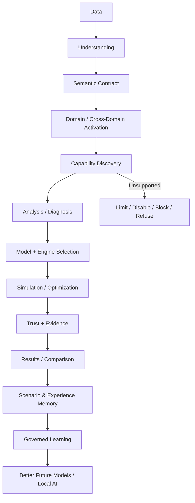
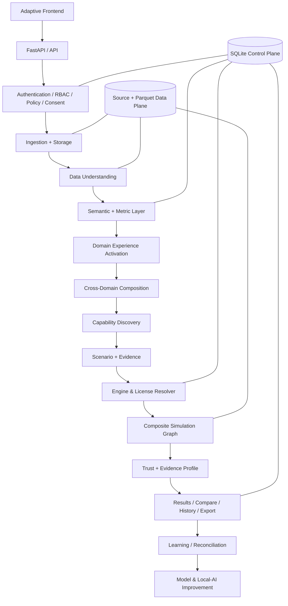
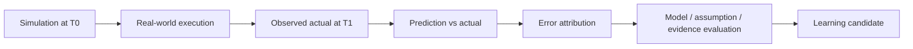
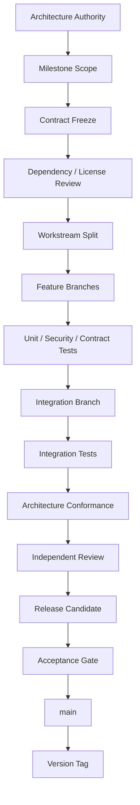

# Intelligent Predictive Simulation Platform (IPSP)

IPSP is a domain-adaptive, dataset-agnostic, evidence-aware platform for responsible analysis, prediction, simulation, optimization, trust, and governed learning. Its purpose is to determine what structured data means; what can responsibly be analyzed, predicted, simulated, optimized, explained, compared, or learned from; and when a requested capability must be limited or refused.

| Status dimension | Current state |
|---|---|
| Current application implementation | **v0.1.0 — FORMALLY ACCEPTED** |
| Development phase | **Phase 1 foundation complete** |
| Independent review | **Phase 1L.1 final review: PASS** |
| Accepted foundation code SHA | **cd0dca48ded8d68f18e861f2427dfeb746d52ea7** |
| Latest architecture authority | **F-002 — FROZEN ARCHITECTURE / PLANNED, NOT IMPLEMENTED** |
| Next planned application milestone | **v0.1.1 — F-002 Architecture Reconciliation, NOT STARTED** |
| Following capability milestone | **v0.2.0 — Data Ingestion, Storage & Provenance, NOT STARTED** |
| Target first General Availability release | **v1.0.0 — NOT RELEASED** |

> **Status boundary:** Labels such as **IMPLEMENTED** and **ACCEPTED** refer only to verified v0.1.0 foundation behavior. **FROZEN ARCHITECTURE / PLANNED** describes the owner-approved F-002 direction. It does not mean those capabilities exist in production. **DEFERRED** and **TENTATIVE POST-v1.0** identify work that is not required for the first General Availability release.

## Product identity

The product and generic application identity is **Intelligent Predictive Simulation Platform (IPSP)**. CampaignSim is the historical prototype and visual reference: its card language, badges, navigation patterns, stepper, dark/light treatment, responsive behavior, and interaction style remain useful design inputs. It is not the platform identity, a source of analytical truth, or an owner of the core architecture. A future Marketing Domain Experience may use suitable marketing terminology without turning IPSP into a marketing-specific product.

The shipped v0.1.0 static frontend still contains prototype-origin branding in its markup. Neutral IPSP shell reconciliation is planned for v0.1.1; this README does not claim that code change has already occurred.

## Architecture and versioning status

F-002 is an architecture-freeze identifier, not an application version and not shorthand for v2.0. Four kinds of version/status identifiers coexist:

| Identifier | Meaning | Example |
|---|---|---|
| Architecture freeze | Owner-approved product and technical direction | F-002 |
| Application version | Semantically versioned shipped application state | v0.1.0, v0.5.0, v1.0.0 |
| Development phase/work package | A bounded implementation or review activity | Phase 1, milestone workstreams |
| Contract version | Compatibility version of a specific interface or persisted contract | /api/v1, Semantic Manifest version, Domain Experience contract version |

Before GA, v0.x.0 identifies an accepted capability milestone, while v0.x.y identifies a compatibility, correction, or reconciliation patch. After GA, v1.x represents backward-compatible capability growth. v2.0 is reserved for a meaningful breaking compatibility change and is not pre-assigned to a feature set.

F-002 supersedes conflicting older wording for this README. The linked specifications remain useful predecessor authorities but have not all been reconciled to F-002 yet; links below do not imply otherwise. The current locked baseline is documented in [Scope Freeze](docs/00_SCOPE_FREEZE.md) and [Decision Log](docs/32_DECISION_LOG.md), with later reconciliation to occur in dedicated tasks.

## The problem IPSP solves

Fixed-schema analytics and simulators begin with a domain story, predefined columns, static KPIs, fixed controls, and a preferred model. That approach fails when datasets differ in grain, time semantics, units, currencies, identifiers, relationships, missing-value conventions, outcome definitions, observation maturity, or business rules. It can multiply measures through unsafe joins, use post-outcome fields as predictors, invent formulas, expose identifiers as controls, treat assumptions as observations, or present prediction as causation.

IPSP begins with a different question:

> Rather than asking “how do we make this dataset fit a simulator?”, IPSP asks “what can this dataset responsibly support?”

A previously unseen dataset should be understood through evidence and explicit contracts, not benchmark-specific production branches. Refusal is a product capability: when semantics, data support, licensing, evidence, or Trust gates fail, IPSP should explain why the capability is limited, disabled, blocked, or unavailable.

## Product definition

IPSP targets structured/tabular data and a local-first operating model. It profiles and versions data, builds a semantic contract, activates relevant Domain Experiences, discovers supportable capabilities, selects valid models and providers, runs supported simulations, evaluates Trust and evidence, preserves results and lineage, and learns only through governed reconciliation.

The canonical F-002 lifecycle is:



Not every dataset traverses every branch. Capability discovery may stop the path, request clarification, or expose only descriptive functions.

## Non-goals

IPSP is not:

- a dashboard generator;
- a fixed Marketing or Finance simulator;
- an AutoML wrapper;
- an LLM chatbot;
- a synthetic-data generator;
- a financial calculator;
- a tool that assumes every dataset matches a predefined schema;
- a system that fabricates unsupported relationships or arbitrary joins;
- a system where prediction is presented as causation;
- a system where an LLM has numerical authority;
- a system where simulated or synthetic outcomes automatically become empirical truth;
- a universal raw document, image, audio, or unstructured-text platform;
- a platform that permits arbitrary LLM-generated code to execute against raw datasets.

## Implemented today versus target v1.0

| Area | Current v0.1.0 evidence | F-002 target |
|---|---|---|
| Runtime/API | **IMPLEMENTED:** Python 3.11+, FastAPI factory, typed Pydantic settings, safe errors, static application | Full capability-driven API and application services |
| Control plane | **IMPLEMENTED:** synchronous SQLAlchemy 2.x, SQLite, one Alembic history, seven application tables | Versioned project, dataset, semantic, metric, engine, model, run, evidence, and learning metadata |
| Authentication/RBAC | **IMPLEMENTED:** Argon2id, opaque server sessions, CSRF, lockout, Admin/User roles backed by 13 permissions | Dataset/project/column policy and runtime-consent governance |
| Secrets/outbound | **IMPLEMENTED:** SecretProvider boundary, environment provider, deny-by-default OutboundPolicy | Provider, evidence-access, consent, and transmission governance |
| Jobs | **IMPLEMENTED:** generic persistent jobs, JobBackend abstraction, LocalJobBackend | Alternative provider implementations when justified |
| Observability/audit | **IMPLEMENTED:** structured rotating JSONL, trace/request/session correlation, durable audit | End-to-end data, model, engine, evidence, simulation, export, and learning traces |
| Health | **IMPLEMENTED:** liveness, readiness, authorized rich diagnostics | Diagnostics for analytical storage and registered engines/providers |
| Frontend foundation | **IMPLEMENTED:** offline HTML/CSS/Vanilla-JS shell, Login, Overview, Jobs, Profile, System Health, themes | Neutral IPSP identity and full capability-driven workspace |
| Ingestion/storage | **NOT IMPLEMENTED** | Structured upload, staging, validation, versioning, originals, canonical Parquet, provenance |
| Understanding/semantics | **NOT IMPLEMENTED** | Deterministic profiling, Dataset Semantic Manifest, clarification, relationship/grain checks |
| Metric & Formula Registry | **NOT IMPLEMENTED** | Versioned semantic metrics and formula computation with lineage |
| Domain Experiences | **NOT IMPLEMENTED** | Registered domain-neutral experience packs and dynamic activation |
| Cross-domain graph | **NOT IMPLEMENTED** | CrossDomainSemanticGraph with validated entity/time/grain/unit/currency relations |
| Capability discovery | **NOT IMPLEMENTED** | Evidence-first enable/limit/disable/block/refuse decisions |
| Engine/license resolution | **NOT IMPLEMENTED** | EngineRegistry, LicenseRegistry, and EngineResolver |
| Modelling | **NOT IMPLEMENTED** | Baselines, leakage-safe validation, registry, champion/challenger lifecycle |
| Simulation | **NOT IMPLEMENTED** | DATA_BASED, MIXED, and INTENT_BASED simulation using CompositeSimulationGraph |
| Trust/evidence | **NOT IMPLEMENTED** | Independent Trust and Evidence Profile evaluation |
| Results/learning | **NOT IMPLEMENTED** | History, compare, re-run, reproduce, exports, SimulationLearningStore, outcome reconciliation |
| LLM providers | **NOT IMPLEMENTED:** policy boundaries only | Optional local assistance; remote/hybrid remain governed and are not required for v1.0 |

The accepted foundation and historical evidence are recorded in [Implementation Progress](docs/31_IMPLEMENTATION_PROGRESS.md) and [Phase 1 Acceptance Report](docs/PHASE_1_ACCEPTANCE_REPORT.md).

## F-002 architecture overview



Security, privacy, outbound controls, secrets, jobs, observability, provenance, licensing, and reproducibility are cross-cutting. Production services depend on IPSP contracts rather than vendor implementations. See the predecessor [System Architecture](docs/03_ARCHITECTURE.md) and [System Flow](flows/01_SYSTEM_ARCHITECTURE.md).

## Storage architecture

The two-plane rule remains frozen:

- **SQLite control/governance/knowledge plane:** identities, permissions, configuration references, metadata, semantic and metric contracts, registry records, runs, jobs, evidence, audit, and learning eligibility.
- **Source + Parquet analytical plane:** immutable originals, canonical structured datasets, analytical views, training references, and simulation artifacts.

SQLite is not the warehouse for millions of analytical rows. Target analytical views require versioned references and validated join plans. See [Architecture](docs/03_ARCHITECTURE.md), [SQLite Schema](docs/27_SQLITE_SCHEMA_SPEC.md), and [Storage Planes](flows/12_STORAGE_PLANES.md).

## Data onboarding, versioning, and provenance

**FROZEN ARCHITECTURE / PLANNED — NOT IMPLEMENTED.** The planned pipeline is authorization → allowlist/limits → generated internal name → signature/archive/path checks → staging or quarantine → parser validation → canonicalization → immutable original → Parquet and metadata registration. CSV/TSV, XLSX, Parquet, JSON/JSONL, and supported archives are target structured inputs.

Datasets and versions retain source identity, checksum, table/sheet structure, sampling role, original coverage where known, transformations, and artifact lineage. Multi-table data is not flattened by default. See [Ingestion and Storage](docs/20_INGESTION_STORAGE_SPEC.md), [Sampling and Provenance](docs/21_SAMPLING_PROVENANCE_SPEC.md), and [Dataset Onboarding](flows/02_DATASET_ONBOARDING.md).

The conceptual provenance families are:

- OBSERVED_DATA
- DERIVED_DATA
- ORGANIZATION_CONFIG
- DOMAIN_CATALOG
- USER_ASSUMPTION
- PRIOR_IPSP_RUN
- OBSERVED_OUTCOME
- CURATED_BENCHMARK
- EXTERNAL_EVIDENCE
- LOCAL_KNOWLEDGE_BASE
- LLM_PROPOSAL
- SYNTHETIC_DATA

Synthetic datasets must identify generator, provider, version, seed, configuration, quality evaluation, and privacy evaluation. They may support privacy-safe development, augmentation, sparse-region exploration, stress testing, robustness analysis, or simulation, but synthetic records never automatically become observed truth.

## Data Understanding and semantic contracts

**FROZEN ARCHITECTURE / PLANNED — NOT IMPLEMENTED.** Deterministic profiling establishes physical and logical types, missingness and sentinels, cardinality, distributions, dates, candidate identifiers and grain, entity scope, dimensions/measures, units/currencies, sensitivity, time availability, functional dependencies, and sampling-aware evidence. Names are evidence, never sufficient authority.

The **Dataset Semantic Manifest** remains the versioned contract for fields, grain, entities, relationships, roles, time, units, lineage, constraints, metrics, capabilities, provenance, conflicts, and confirmations. The order is deterministic evidence → structured proposal → validation → targeted confirmation where ambiguous → persistence. LLM confidence alone never establishes semantics.

See [Data Understanding](docs/07_DATA_UNDERSTANDING_SPEC.md), [Semantic Model](docs/08_SEMANTIC_MODEL_SPEC.md), [Data Intelligence Packet](flows/03_DATA_INTELLIGENCE_PACKET.md), and [Semantic Clarification](flows/04_SEMANTIC_CLARIFICATION.md).

## Relationships, grain, hierarchy, and lineage

Structural, identity, temporal, lifecycle, journey, hierarchy, measure-dependency, plan/actual, and commercial-flow relationships require explicit semantics. Each relationship carries direction, cardinality, time and selection rules, evidence, and support state. Feature lineage records derivation, transformation, binning, aggregation, canonicalization, and temporal availability.

Before a join, IPSP must validate entity grain, aggregation grain, cardinality, and measure multiplication risk. It must never directly aggregate a one-side measure after a one-to-many join without a safe transformation. Ordered journeys are not forced into strict monotonic funnels when cohorts, units, re-entry, or measurement semantics do not justify it. See [Relationships, Hierarchy and Lineage](docs/09_RELATIONSHIPS_HIERARCHY_LINEAGE_SPEC.md), [Relationship Discovery](flows/05_RELATIONSHIP_DISCOVERY.md), and [Prediction Horizon and Leakage](flows/17_PREDICTION_HORIZON_LEAKAGE.md).

## Metric & Formula Registry

**FROZEN ARCHITECTURE / PLANNED — NOT IMPLEMENTED.** F-002 expands the predecessor Metric Dependency Graph into a provider-neutral **Metric & Formula Registry**. Domain Experiences request semantic metric IDs; the registry validates prerequisites; a generic compute engine evaluates formulas; the result retains complete lineage.

A metric definition conceptually contains metric ID, version, semantic inputs, formula, aggregation and time semantics, units/currencies, null behavior, required grain, validation tests, and source/provenance. Arithmetic compatibility, denominator meaning, safe division, filters, state qualifications, and observed stored values are validated where applicable.

> **Domain Pack ≠ Formula Engine.** Domain knowledge may request a metric; it does not own numerical truth.

The existing [KPI and Metric Dependency Specification](docs/10_KPI_METRIC_DEPENDENCY_SPEC.md) describes the predecessor validation and dependency representation. It should not be read as the complete F-002 registry contract.

## Domain Experience architecture

**FROZEN ARCHITECTURE / PLANNED — NOT IMPLEMENTED.** IPSP Core remains domain-neutral and composes with registered **Domain Experience Packs**. Frozen domain families are:

- Marketing
- Product
- Sales
- Customer Experience
- Finance
- Operations / Demand
- Generic / Custom
- Composite / Cross-Domain

A dataset may activate one domain, several domains, or a Composite/Cross-Domain capability. Packs may provide terminology, objective taxonomy, semantic concepts, metric requests, control templates, UI metadata, recommended analysis sections, comparison views, explanation vocabulary, optional benchmark knowledge, and semantic/capability prerequisites.

Packs do not own generic numerical truth, mandatory physical columns, hardcoded model choices, guaranteed responses, or arbitrary domain-specific production branching. Catalog precedence is:

1. organization-configured;
2. observed or confirmed dataset values;
3. curated Domain Experience Pack;
4. explicit custom user assumption.

The architecture permits future independent pack versions without claiming that packaging exists today—for example IPSP Core 1.x with independently versioned Marketing, Product, Sales, CX, Finance, and Operations experiences.

## CrossDomainSemanticGraph

**FROZEN ARCHITECTURE / PLANNED — NOT IMPLEMENTED.** The **CrossDomainSemanticGraph** describes validated relationships across concepts. Each link records source and target concepts, entity relationship, time relationship, grain relationship, units, currency, transformation, evidence, and support status.

Cross-domain inference follows infer → validate → confirm if ambiguous → persist. Composition must reconcile entity and aggregation grain, time zones, calendar and fiscal periods, currencies, and units. IPSP never invents an arbitrary join merely to make a composite scenario possible.

## Capability Discovery

**FROZEN ARCHITECTURE / PLANNED — NOT IMPLEMENTED.** Capability discovery determines whether the evidence responsibly supports:

- descriptive and diagnostic analysis;
- forecasting, regression, classification, and count prediction;
- similarity/look-alike and clustering/segmentation;
- deterministic what-if and sensitivity analysis;
- Monte Carlo and risk/stress analysis;
- synthetic-assisted analysis;
- optimization or causal analysis where independently supported;
- Cross-Domain Composite simulation where supported.

Every candidate passes semantic, data, model/engine, and Trust gates. The existence of a target-like column does not enable a predictive model. Unsupported capabilities remain visible when useful but are limited, disabled, blocked, or refused with reason codes. See [Capability Discovery](docs/11_CAPABILITY_DISCOVERY_SPEC.md) and [Capability Flow](flows/06_CAPABILITY_DISCOVERY.md).

## Engine and license architecture

**FROZEN ARCHITECTURE / PLANNED — NOT IMPLEMENTED.** F-002 introduces three complementary authorities:

```text
EngineRegistry + LicenseRegistry + EngineResolver
```

Application services depend on IPSP interfaces. Candidate adapters may include a SyntheticDataProvider with SynthcityProvider and an optional SDVProvider; an OptimizerProvider with OSQPProvider, SCSProvider, and optional commercial providers; and an LLMProvider with local llama.cpp, remote, and hybrid adapters. Vendor libraries are implementations, not the architecture.

Synthetic capability is provider-neutral. Synthcity is the preferred permissive default candidate; SDV is optional and subject to current licensing policy. SDV is not assumed to be automatically open source.

License metadata conceptually includes engine ID, library and version, provider, license identifier/class, commercial-use and redistribution/service restrictions, model-weight license, approved use, installed status, capabilities, hardware needs, and security status. Frozen classes are:

- PERMISSIVE_OPEN_SOURCE
- PUBLIC_DOMAIN
- COPYLEFT_OPEN_SOURCE
- SOURCE_AVAILABLE
- COMMERCIAL
- CUSTOM_MODEL_LICENSE
- UNKNOWN/BLOCKED

Organization modes are OPEN_SOURCE_ONLY, OPEN_SOURCE_PREFERRED, and COMMERCIAL_ALLOWED. The default is **OPEN_SOURCE_PREFERRED**. Resolution priority is capability validity → license policy → Trust/validation → data suitability → performance → available resources → organization preference.

A dependency license and a model-weight license are separate governance decisions. Approval of one never silently approves the other.

## Modelling and model lifecycle

**FROZEN ARCHITECTURE / PLANNED — NOT IMPLEMENTED.** There is no universal best model. Selection depends on target semantics, size and grain, horizon, class balance, temporal structure, explainability and uncertainty requirements, compute, license policy, benchmark evidence, and Trust gates. Every candidate set includes a meaningful baseline.

Compact candidate families include linear/logistic and regularized models, trees, Random Forest, ExtraTrees, and gradient boosting such as LightGBM, XGBoost, or CatBoost. Time-series candidates include naive and seasonal-naive baselines, rolling/statistical methods, ETS/state-space, ARIMA/SARIMAX, VAR/VECM where justified, lag-feature ML, Bayesian models where justified, and ARCH/GARCH only when volatility semantics support them. Temporal problems must not use inappropriate random splits.

Candidate models enter a controlled TRAINING → CANDIDATE → CHALLENGER → CHAMPION or REJECTED/ARCHIVED lifecycle. Promotion depends on validation, calibration, temporal/entity holdout, stability, robustness, explainability, constraints, resources, and baseline comparison. See [Modelling Engine](docs/12_MODELING_ENGINE_SPEC.md), [Model Registry](docs/13_MODEL_REGISTRY_LIFECYCLE_SPEC.md), and [Model Lifecycle](flows/07_MODEL_LIFECYCLE.md).

### Causal boundary

**Correlation ≠ prediction ≠ attribution ≠ causation.** Causal capability activates only when treatment, outcome, confounders, identification assumptions, and validation/refutation evidence are sufficient. Observational predictive association is never described as causal impact. Production causal workflows are not implemented today.

## Simulation architecture

**FROZEN ARCHITECTURE / PLANNED — NOT IMPLEMENTED.** The frozen simulation basis has exactly three values:

| Basis | Meaning |
|---|---|
| DATA_BASED | Primarily supported by observed/derived first-party data and validated models or formulas |
| MIXED | Combines empirical evidence with explicit assumptions, analogs, benchmarks, synthetic support, or external evidence |
| INTENT_BASED | Starts from an objective where empirical support may be incomplete; limitations and assumptions remain explicit |

There is no fourth basis. Intent-based output never silently masquerades as observed truth.

### ScenarioIntentManifest

The planned **ScenarioIntentManifest** records domains, objective, outcome, horizon, geography, population/entity, resources, goals, controls, constraints, assumptions, comparison basis, uncertainty preference, evidence access, and consent snapshot.

### CompositeSimulationGraph

The planned **CompositeSimulationGraph** is the universal execution abstraction. Nodes may represent deterministic formulas, statistical/ML/time-series/causal models, Monte Carlo, optimizers, synthetic support, benchmarks, analogs, external-evidence transforms, user assumptions, or constraints.

Edges explicitly identify deterministic relation, observed association, predictive relation, causal estimate, assumption, external prior, analog prior, or constraint. If no defensible relationship exists, IPSP constrains or refuses the path; it does not fabricate an edge.

### Five-step simulation experience

The canonical experience has exactly five steps:

1. Define
2. Configure
3. Enrich & Validate
4. Run
5. Results & Compare

The predecessor [Simulation Specification](docs/14_SIMULATION_ENGINE_SPEC.md) and [Simulation Flow](flows/08_SIMULATION_EXECUTION.md) remain useful for support checks, control eligibility, Trust routing, and reproducibility, but their older engine classification is superseded here by F-002.

## Cross-Domain Composite simulation

**FROZEN ARCHITECTURE / PLANNED — NOT IMPLEMENTED.** Composite/Cross-Domain is a first-class capability, not a guarantee that unrelated datasets can be joined. Representative—not hardcoded—paths include:

- Marketing: spend → response → leads → opportunities → orders → revenue → margin → cash.
- Product/Operations: price or launch → demand → inventory → fulfilment → cost → margin → working capital.
- Customer Experience: service/experience → satisfaction or sentiment → retention/churn → renewal → revenue/customer value.

Every node and edge still requires semantic, grain, time, unit/currency, evidence, model/engine, and Trust validation. Missing relationships are clarified, constrained, or refused.

## Finance Domain Experience

**FROZEN ARCHITECTURE / PLANNED — NOT IMPLEMENTED.** Finance is a first-class dynamically activated Domain Experience, not one mandatory schema and not a branch inside generic core.

- **Corporate Performance / FP&A:** actual/budget/forecast, variance, revenue, cost, margin, profitability, contribution, operating leverage, unit economics, scenario budgets, rolling forecasts, targets.
- **Forecasting:** revenue, expense, gross margin, opex, cash, AR/AP, inventory/working capital, liquidity, and business-unit or ratio forecasts.
- **Treasury & Liquidity:** cash, runway, receivable/payable timing, working capital, funding, debt schedules, interest, FX, and cash conversion cycle.
- **Three-statement relationships:** Income Statement ↔ Balance Sheet ↔ Cash Flow only when semantics are sufficient and accounting constraints reconcile.
- **Risk & Stress:** deterministic stress, historical replay, Monte Carlo, volatility, sensitivity, revenue/cost/rate/FX/liquidity shocks, and appropriate VaR-style analysis.
- **Credit / Collections:** payment, lateness, delinquency, default, collection, and delay where supported.
- **Valuation / Capital Investment:** NPV, IRR, DCF, payback, project comparison, discount-rate sensitivity, and terminal-value sensitivity.

QuantLib-based instrument pricing is an optional future Finance subpack. It does not contaminate ordinary FP&A architecture and does not block v1.0.

## Other Domain Experiences

**FROZEN ARCHITECTURE / PLANNED — NOT IMPLEMENTED.** Curated packs provide optional vocabulary and prerequisites:

- **Product:** lifecycle, launch performance, adoption, demand, price, orders, returns, inventory, and product performance.
- **Sales:** account, opportunity, pipeline, stage, territory, target, quota, forecast, won/lost, orders, and revenue.
- **Customer Experience:** customer, service interaction, CSAT, NPS, CES, issue, resolution, complaint, churn, retention, and structured sentiment-derived signals. This is not a promise of universal raw text processing.
- **Operations / Demand:** demand, inventory, capacity, backlog, lead time, fulfilment, supplier, production, service level, and stockout.
- **Generic / Custom:** evidence-led operation when no curated pack fits; this proves the core remains domain-neutral.

## Trust and Evidence Profiles

**FROZEN ARCHITECTURE / PLANNED — NOT IMPLEMENTED.** Trust is independent of model or LLM confidence. It evaluates data quality, semantic confidence, relationship validity, model validation, temporal leakage, support and extrapolation, constraints, accounting reconciliation, unit/currency/time consistency, simulation support, optimization feasibility, privacy, outbound policy, licensing, and reproducibility.

Green means required checks pass; Amber means limited evidence, novelty, extrapolation, or review; Red blocks a critical ambiguity or violation. Intrinsic constraints, confirmed semantic constraints, explicit business constraints, and empirical expectations remain distinct. A negative financial value is not universally invalid.

An **Evidence Profile** is separate from Trust, not folded into one score. It describes dependence on first-party history, observed outcomes, assumptions, synthetic data, analogs, external evidence, extrapolation, evidence freshness, and evidence coverage.

The governing principle remains: **AI proposes. Evidence validates. Rules constrain. Models compete. Humans arbitrate exceptions. The system remembers the outcome.** See [Trust and Validation](docs/15_TRUST_AND_VALIDATION_SPEC.md) and [Trust Flow](flows/09_TRUST_VALIDATION.md).

## Results, history, comparison, and reproducibility

**FROZEN ARCHITECTURE / PLANNED — NOT IMPLEMENTED.** Persisted result objects support history, comparison, report generation, and exact lineage.

- **RE-RUN:** execute the same scenario intent using currently eligible models and evidence; newer evidence may apply.
- **REPRODUCE:** reconstruct the historical original using its evidence snapshot, dataset version, semantic version, metric version, model version, engine/provider version, assumptions, seed, configuration, graph version, and applicable policy context.

PDF and Excel are generated from persisted results, not browser screenshots, and remain subject to dataset and column policy. See [Reporting and Export](docs/25_REPORTING_EXPORT_SPEC.md), [History and Reproducibility](docs/26_SIMULATION_HISTORY_REPRODUCIBILITY.md), and [Report Flow](flows/14_REPORT_EXPORT.md).

## Governed learning and SimulationLearningStore

**FROZEN ARCHITECTURE / PLANNED — NOT IMPLEMENTED.**

> Every simulation becomes a learning experience; not every simulation becomes empirical truth.

Evidence authority is tiered. Observed actual outcomes are highest; derived observed data with lineage is high; data-based simulations, mixed simulations, intent-based simulations, and LLM proposals remain lower or non-empirical.

The planned **SimulationLearningStore** retains scenario intent, basis, domains, inputs, controls, constraints, assumptions, evidence, models, graph, outputs, uncertainty, Trust, Evidence Profile, user corrections/actions, and later observed outcomes. It is conceptually separate from empirical analytical data so simulation records cannot contaminate observed truth.

### Outcome Reconciliation



Reconciliation does not immediately retrain after every run. Eligible outcomes enter a governed path:

```text
New Data / Reconciled Outcomes
  → Learning Eligibility Gate
  → Training Dataset Builder
  → Leakage + Provenance Validation
  → Challenger
  → Validation + Trust
  → Champion Comparison
  → Promote or Reject
```

Governed batch retraining is the default. River-style incremental learning is considered only where true streaming semantics justify it.

## ML, LLM, and local-AI authority

Numerical authority remains with **ML, statistics, and deterministic engines**. LLMs assist with semantics, intent interpretation, clarification, domain reasoning, capability explanation, analog ranking, evidence planning, result explanation, and organization terminology.

The frozen modes remain ML_ONLY, LOCAL_LLM, REMOTE_LLM, and HYBRID_LLM. Deterministic profiling produces a compact Dataset Intelligence Packet; structured LLM output is validated against schemas and evidence. Raw datasets are not wholesale transmitted to remote providers.

Local-AI learning prefers:

1. continuous governed retrieval and memory;
2. optional periodic PEFT/LoRA adaptation after review.

Confirmed mappings, corrections, interpretations, clarification outcomes, intent parsing, validated controls, capability reasoning, analog ranking, evidence plans, approved explanations, and organization vocabulary may become learning material. Intent-based results, mixed assumptions, synthetic records, unverified external claims, LLM-proposed numbers, or decontextualized failed predictions never become empirical facts. Fine-tuning does not grant numerical authority.

Evidence-access modes are OFF, INTERNAL_ONLY, PUBLIC_WEB, and APPROVED_CONNECTORS. Effective access is the intersection of Admin policy, project/dataset policy, and runtime user consent. PUBLIC_WEB and APPROVED_CONNECTORS are **NOT IMPLEMENTED** today. See [LLM Architecture](docs/16_LLM_ARCHITECTURE.md), [Remote Privacy Policy](docs/17_PRIVACY_REMOTE_LLM_POLICY.md), [LLM Routing](flows/10_LLM_ROUTING.md), and [Remote Privacy Flow](flows/16_PRIVACY_REMOTE_LLM.md).

## Security, RBAC, privacy, and outbound governance

### Implemented — v0.1.0

Authorization follows User → Role → RolePermission → Permission. There is no persisted or name-based Admin bypass. The canonical permission set is:

- simulation.run
- simulation.export
- dataset.view
- dataset.upload
- dataset.configure
- dataset.assign
- model.train
- model.promote
- llm.configure
- internet.configure
- user.manage
- logs.view
- system.configure

Passwords use Argon2id. Browser authentication uses rotated opaque server-side sessions with hash-only persistence, HttpOnly/Secure/SameSite cookies, CSRF on state-changing operations, expiry, logout/password/privilege invalidation, failed-login lockout, and a one-time first-Admin CLI. Secrets are references resolved by SecretProvider; production does not store ordinary plaintext credentials. OutboundPolicy is backend-enforced and deny-by-default.

### F-002 target — planned

Future governance adds engine-license and model-weight gates, evidence policy, runtime consent, dataset/project/column policy, provenance, and learning eligibility. It does not weaken existing outbound defaults. See [Security and RBAC](docs/18_SECURITY_RBAC_SPEC.md), [Outbound, Secrets and Configuration](docs/19_OUTBOUND_SECRETS_CONFIG_SPEC.md), and [Auth/RBAC Flow](flows/11_AUTH_RBAC.md).

## Background jobs

### Implemented — v0.1.0

The durable generic vocabulary contains QUEUED, RUNNING, SUCCEEDED, FAILED, and CANCELLED states and nine dataset-agnostic job types. Job metadata supports progress, owner and trace correlation, cancellation, retry, safe artifact references, and sanitized errors. There is no public generic submit endpoint; registered trusted handlers own execution.

LocalJobBackend is deliberately a **single-process execution provider**. **Do not run multiple active local worker processes** against one SQLite control-plane database. Future distributed execution requires another JobBackend provider with ownership and leases. Redis and Celery are not current dependencies and are not mandatory for v1.0. See [Job Processing](docs/24_JOB_PROCESSING_SPEC.md) and [Background Job Flow](flows/15_BACKGROUND_JOBS.md).

## Observability, errors, and health

### Implemented — v0.1.0

Meaningful operations carry structured event, trace, request, component, action, status, and severity fields, plus safe contextual identifiers where available. Runtime volume goes to console and rotating UTF-8 JSONL; selected audit/security events persist in SQLite. Passwords, hashes, cookies, bearer and CSRF tokens, authorization headers, request bodies, raw sensitive records, and unsafe exception values are excluded.

Clients receive stable safe error codes, messages, trace IDs, and recoverability hints; production API/UI responses never expose raw stack traces. Current health surfaces are:

- GET /health/live — minimal process liveness;
- GET /health/ready — safe application/database/migration/runtime readiness;
- GET /api/v1/admin/system/health — sanitized rich diagnostics protected by system.configure.

Rich diagnostics do not perform unapproved remote probes and report deferred or never-run capabilities honestly. See [Observability](docs/22_OBSERVABILITY_AUDIT_SPEC.md), [Error Handling](docs/23_ERROR_HANDLING_SPEC.md), [System Health](docs/37_SYSTEM_HEALTH_SPEC.md), and [Trace Flow](flows/13_OBSERVABILITY_TRACE.md).

## UI and experience architecture

### Implemented — v0.1.0

The current offline frontend uses semantic HTML, modular CSS, and Vanilla JavaScript ES modules with no npm build, public CDN, remote font, analytics, or frontend framework. It includes Login, forced password change, Overview, owner-visible Jobs, Profile, authorized System Health, safe loading/empty/error/permission states, responsive layouts, reduced-motion support, print styles, and System/Dark/Light themes. Identity stays in memory; only theme preference uses localStorage.

### F-002 target — planned

The neutral IPSP navigation target includes Home/Overview, Projects/Workspaces, Data, Scenario Library, Compare, Models & Learning, Jobs, Administration, and Profile. Analysis & Simulation may activate Marketing, Product, Sales, Customer Experience, Finance, Operations, Generic/Custom, and Composite/Cross-Domain entries. Domain pages are dynamically exposed only when supported.

A standard experience may expose Overview, Data Fit, Analyze, Diagnose/Drivers, Simulate, Compare, and History. Finance may expose Overview, Data Fit, Performance, Forecast, Drivers, Cash & Liquidity, Risk & Stress, Valuation, Optimize, Simulate, Compare, and History. Composite may expose Scope, Domain Graph, Data Fit, Analyze, Drivers, Simulate, Cascade Results, Optimize, Compare, and History. These are templates, not guaranteed static pages.

The visual reference contributes style and interaction patterns only. See [UI/UX Specification](docs/05_UI_UX_SPEC.md), [Design System](docs/06_UI_DESIGN_SYSTEM.md), and [Reference Rules](reference/README.md).

## Anti-contamination

Generic production core must not contain benchmark, prototype, or business-domain special cases. Domain knowledge belongs in registered Domain Experience Packs, Metric/Formula Registry definitions, explicit organization configuration, or benchmark fixtures/tests/reference documentation.

Core services must not accumulate hardcoded branching for Marketing, Finance, Product, or any other business family. Generic registry/provider dispatch may resolve registered capabilities; it may not embed source schemas, KPIs, stages, controls, formulas, or preferred models. CampaignSim terms do not define generic application identity.

The seven benchmark families test discovery across scale, multi-table grain, identity and event attribution, customer journeys, fiscal/finance measures, wide sensitive household data, and ecommerce personas/leakage. They are tests of generic behavior, not product schemas. See [Benchmark Catalog](docs/39_BENCHMARK_CATALOG.md) and [Anti-Contamination Rules](docs/40_ANTI_CONTAMINATION.md).

## Technical direction

The technology view distinguishes what is active, what F-002 approves as a candidate, and what remains optional:

| Area | Active in v0.1.0 | FROZEN/approved candidate direction | Optional later provider |
|---|---|---|---|
| Runtime/API | Python 3.11+, FastAPI, Uvicorn, Pydantic | Existing typed service/API direction | — |
| Control plane | SQLAlchemy, SQLite, Alembic | Portable repository boundary | PostgreSQL after v1.0 if needed |
| Analytical data | None | Polars, Apache Arrow/PyArrow, Parquet; Pandas where required; Plotly.js for charts | — |
| ML | None | scikit-learn, LightGBM, XGBoost, CatBoost | Provider expansion under registry policy |
| Statistics/econometrics | None | Statsmodels, arch; PyMC where Bayesian modelling is justified | — |
| Causal | None | DoWhy, EconML | causal-learn where justified |
| Explainability/tuning | None | SHAP, Optuna | — |
| Synthetic | None | Provider-neutral interface; Synthcity preferred permissive candidate | SDV subject to licensing policy |
| Optimization | None | CVXPY abstraction, OSQP, SCS | Commercial solvers under policy |
| Finance | None | arch where appropriate | QuantLib for specialized instrument/quant use cases |
| Incremental learning | None | Governed batch learning | River only for genuine streaming semantics |
| Local AI | None | llama.cpp, Transformers | PEFT/LoRA and optional MLflow |
| Frontend | HTML/CSS/Vanilla JS, local assets | Capability-driven UI and locally vendored Plotly.js | — |

Names in the candidate columns do not mean packages are installed, approved for every deployment, or operational. Direct current dependencies are in [pyproject.toml](pyproject.toml) and [requirements.lock](requirements.lock).

## Repository structure

The current repository contains the accepted foundation:

```text
IPSP/
├── backend/ipsp/
│   ├── api/{routes,schemas,dependencies}
│   ├── auth/ and security/
│   ├── database/models/
│   ├── repositories/ and services/
│   ├── jobs/ and observability/
│   └── errors/, config/, cli/
├── database/migrations/
├── frontend/
├── tests/{unit,integration,security,architecture}
├── docs/
├── flows/
├── prompts/
├── reference/
└── config/
```

F-002 target structure remains provider-neutral. Future packages may group engines under synthetic, optimization, ML, statistics, and finance interfaces. Artifacts may be grouped as models, manifests, reports, simulations, synthetic, and evidence—not around one vendor. These directories are conceptual and have not been created by this README task.

Canonical ownership remains: ORM under backend/ipsp/database/models, API schemas under backend/ipsp/api/schemas, routes under backend/ipsp/api/routes, migrations under database/migrations, and SQL access through repositories. See [Project Structure](docs/04_PROJECT_STRUCTURE.md).

## Current API surface

Only these v0.1.0 runtime routes are implemented:

| Method | Route | Purpose |
|---|---|---|
| GET | / | Static offline frontend |
| GET | /api/v1 and /api/v1/ | Safe application/browser bootstrap metadata |
| POST | /api/v1/auth/login | Authenticate and rotate an opaque session |
| GET | /api/v1/auth/me | Return current safe identity |
| POST | /api/v1/auth/logout | CSRF-protected logout |
| POST | /api/v1/auth/change-password | CSRF-protected password change |
| GET | /api/v1/jobs | Owner-scoped bounded job list |
| GET | /api/v1/jobs/{job_id} | Owner-scoped job detail |
| POST | /api/v1/jobs/{job_id}/cancel | Owner/CSRF-protected cancellation |
| POST | /api/v1/jobs/{job_id}/retry | Owner/CSRF-protected retry |
| GET | /health/live | Minimal liveness |
| GET | /health/ready | Minimal readiness |
| GET | /api/v1/admin/system/health | Permission-protected rich diagnostics |

Future project, dataset, model, simulation, evidence, learning, report, and provider routes are architectural reservations, not implemented endpoints. See [REST API Contract](docs/28_REST_API_CONTRACT.md).

## Local development

Python 3.11 or newer is required. From the repository root in PowerShell:

```powershell
python -m venv .venv
.\.venv\Scripts\Activate.ps1
python -m pip install --upgrade pip
python -m pip install -e ".[dev]"
python -m alembic upgrade head
python -m alembic current
ipsp-create-admin
```

For existing installations, ipsp-sync-rbac additively ensures the Admin/User roles, the 13 core permissions, and missing Admin mappings without deleting custom entries.

Authentication cookies are Secure by default, and production requires HTTPS. For plain-HTTP localhost development only:

```powershell
$env:IPSP_AUTH__COOKIE_SECURE = "false"
python -m uvicorn ipsp.main:create_app --factory --reload
```

Open http://127.0.0.1:8000. Never use the insecure-cookie override in production. The implemented foundation operates offline. Copy .env.example to an ignored .env only for non-secret overrides; secrets remain separate process entries resolved through SecretRef. See [Configuration](config/README.md).

For the exact lock:

```powershell
python -m pip install -r requirements.lock
python -m pip install -e . --no-deps
```

## Quality and historical acceptance evidence

Repository quality is layered across unit, integration, security/privacy, architecture conformance, future semantic benchmarks, and milestone acceptance:

```powershell
python -m compileall -q backend tests
python -m pytest
python -m ruff check .
python -m ruff format --check .
python -m mypy backend/ipsp
python -m pip check
git diff --check
```

**Historical acceptance evidence—not a new test run:** the Phase 1L.1 audit recorded two clean planned 216-test full-suite runs, focused job/process-lifecycle stability, architecture/security checks, isolated migration validation, a disposable locked installation, and responsive browser QA. This README-only task does not claim that the suite was rerun. See [Test Strategy](docs/29_TEST_STRATEGY.md), [Acceptance Criteria](docs/30_ACCEPTANCE_CRITERIA.md), and [Phase 1 Acceptance Report](docs/PHASE_1_ACCEPTANCE_REPORT.md).

## Versioning philosophy

Application versions follow semantic versioning; version numbers are not decimal fractions. v0.10.0 validly follows v0.9.0. Architecture freezes, application releases, work packages, and individual contract versions advance independently.

Domain Experience Packs may eventually carry versions independently of IPSP Core, but that packaging is **FROZEN ARCHITECTURE / PLANNED**, not current functionality.

## Revised pre-v1.0 roadmap

This F-002 roadmap replaces the old compressed v0.2–v0.9 schedule in this README:

| Version | Milestone | Status |
|---|---|---|
| v0.1.0 | Foundation / Security / Repository Shell | **FORMALLY ACCEPTED** |
| v0.1.1 | F-002 Architecture Reconciliation | **PLANNED — NOT STARTED** |
| v0.2.0 | Data Ingestion, Storage & Provenance | **NOT STARTED** |
| v0.3.0 | Deterministic Data Understanding & Relationships | **NOT STARTED** |
| v0.4.0 | Semantic Intelligence & Dataset Semantic Manifest | **NOT STARTED** |
| v0.5.0 | Metric / Formula Registry + Domain Experience Foundation | **NOT STARTED** |
| v0.6.0 | Capability Discovery + Engine/License Registry | **NOT STARTED** |
| v0.7.0 | Core Modelling + Model Lifecycle | **NOT STARTED** |
| v0.8.0 | Simulation Core: three bases, ScenarioIntentManifest, CompositeSimulationGraph foundation | **NOT STARTED** |
| v0.9.0 | Trust + Evidence + History + Comparison | **NOT STARTED** |
| v0.10.0 | Cross-Domain Composite Intelligence | **NOT STARTED** |
| v0.11.0 | Domain Intelligence Completion | **NOT STARTED** |
| v0.12.0 | Learning + Outcome Reconciliation Foundation | **NOT STARTED** |
| v0.13.0 | Local AI | **NOT STARTED** |
| v0.14.0 | Full Dynamic Product UI | **NOT STARTED** |
| v0.15.0 | v1.0 Release Candidate / Hardening | **NOT STARTED** |
| v1.0.0 | First General Availability release | **TARGET — NOT RELEASED** |

v0.1.1 aligns accepted foundation documentation and contracts with F-002: authority, neutral branding, provider-neutral synthetic naming, Domain Experience, Metric Registry, Engine/License, Composite/Cross-Domain, learning, anti-contamination, flow, license-governance, and regression contracts. It is not described as complete. v0.2 must not begin until reconciliation is complete.

## What v1.0 means

v1.0 is the first complete, production-usable expression of the IPSP architecture—not every capability IPSP may ever support.

Expected v1.0 scope includes:

- secure local-first projects/workspaces;
- structured ingestion, dataset versioning, and provenance;
- deterministic understanding, relationship/grain validation, and Dataset Semantic Manifest;
- Metric & Formula Registry and Domain Experience framework;
- baseline Marketing, Product, Sales, Customer Experience, Finance, Operations/Demand, and Generic/Custom experiences;
- capability discovery and responsible refusal;
- core statistical/ML modelling, forecasting, explainability, and champion/challenger lifecycle;
- EngineRegistry, LicenseRegistry, and open-source-preferred resolution;
- DATA_BASED, MIXED, and INTENT_BASED simulation;
- CompositeSimulationGraph and basic defensible Cross-Domain simulation;
- Monte Carlo where valid;
- Trust and separate Evidence Profiles;
- Scenario Library, Compare, Re-run, and Reproduce;
- SimulationLearningStore and Outcome Reconciliation foundation;
- governed learning;
- optional local LLM assistance;
- PDF/Excel export and full capability-driven UI.

## Capabilities deferred beyond v1.0

The following do not block v1.0:

- production-mature advanced causal workflows using DoWhy/EconML;
- full solver-backed decision optimization with CVXPY/OSQP/SCS or commercial solvers;
- automated PEFT/LoRA lifecycle;
- Remote or Hybrid LLM operation;
- PUBLIC_WEB evidence and APPROVED_CONNECTORS;
- enterprise connectors such as business systems and warehouses;
- enterprise identity and advanced organization policy;
- PostgreSQL, Redis, Celery, Kubernetes, object storage, multi-node workers, or horizontal scaling;
- specialized QuantLib instrument pricing.

## Tentative post-v1.0 direction

This strategy is **TENTATIVE POST-v1.0**, not an immutable commitment:

| Version | Direction | Examples |
|---|---|---|
| v1.1 | Advanced Learning & Decision Intelligence | stronger reconciliation, drift, governed retraining, local semantic memory, optional PEFT/LoRA evaluation |
| v1.2 | Causal & Optimization Intelligence | DoWhy, EconML, CVXPY, OSQP/SCS, resource and capacity optimization |
| v1.3 | External Intelligence | PUBLIC_WEB evidence, approved evidence providers, Remote/Hybrid LLM, research flows |
| v1.4 | Enterprise Integrations | warehouse/business connectors, enterprise identity, organization policy |
| v1.5 | Enterprise Scale | optional PostgreSQL, distributed workers, object-like storage, horizontal scaling |

v2.0 is not pre-assigned. It remains reserved for a meaningful breaking compatibility change.

## Development and parallel-integration workflow

The repository uses same-version, different-module parallel development with Kedar as integration owner and final merge authority:



Before implementation, each milestone freezes functional, data/schema, API/interface, acceptance, and dependency/license contracts. Workstreams declare branch, base SHA, merge target, owner, path authority, migration owner, shared contracts, and gates. Contributors push only their assigned branches; Kedar resolves semantic conflicts and integrates. Branch PASS is not milestone PASS.

The existing v0.2 workstream documents predate the F-002 sequencing change and must be reconciled during v0.1.1 before v0.2 begins. See [Parallel Development Workflow](docs/41_PARALLEL_DEVELOPMENT_WORKFLOW.md), [Active Workstreams](docs/42_ACTIVE_WORKSTREAMS.md), [Workstream Contract Template](docs/43_WORKSTREAM_CONTRACT_TEMPLATE.md), and [Parallel Flow](flows/21_PARALLEL_DEVELOPMENT.md).

## Documentation map

| Area | Entry points |
|---|---|
| Product and scope | [Scope Freeze](docs/00_SCOPE_FREEZE.md), [Project Specification](docs/01_PROJECT_SPEC.md), [Product Requirements](docs/02_PRODUCT_REQUIREMENTS.md) |
| Architecture and ownership | [Architecture](docs/03_ARCHITECTURE.md), [Project Structure](docs/04_PROJECT_STRUCTURE.md), [Decision Log](docs/32_DECISION_LOG.md) |
| UI and reference | [UI/UX](docs/05_UI_UX_SPEC.md), [Design System](docs/06_UI_DESIGN_SYSTEM.md), [Reference Rules](reference/README.md) |
| Data and semantics | [Data Understanding](docs/07_DATA_UNDERSTANDING_SPEC.md), [Semantic Model](docs/08_SEMANTIC_MODEL_SPEC.md), [Relationships](docs/09_RELATIONSHIPS_HIERARCHY_LINEAGE_SPEC.md), [Metric Predecessor](docs/10_KPI_METRIC_DEPENDENCY_SPEC.md) |
| Capabilities and models | [Capability Discovery](docs/11_CAPABILITY_DISCOVERY_SPEC.md), [Modelling](docs/12_MODELING_ENGINE_SPEC.md), [Model Lifecycle](docs/13_MODEL_REGISTRY_LIFECYCLE_SPEC.md) |
| Simulation and Trust | [Simulation Predecessor](docs/14_SIMULATION_ENGINE_SPEC.md), [Trust](docs/15_TRUST_AND_VALIDATION_SPEC.md), [History](docs/26_SIMULATION_HISTORY_REPRODUCIBILITY.md) |
| LLM, privacy, security | [LLM](docs/16_LLM_ARCHITECTURE.md), [Remote Privacy](docs/17_PRIVACY_REMOTE_LLM_POLICY.md), [RBAC](docs/18_SECURITY_RBAC_SPEC.md), [Outbound and Secrets](docs/19_OUTBOUND_SECRETS_CONFIG_SPEC.md) |
| Data lifecycle | [Ingestion](docs/20_INGESTION_STORAGE_SPEC.md), [Sampling](docs/21_SAMPLING_PROVENANCE_SPEC.md) |
| Operations | [Observability](docs/22_OBSERVABILITY_AUDIT_SPEC.md), [Errors](docs/23_ERROR_HANDLING_SPEC.md), [Jobs](docs/24_JOB_PROCESSING_SPEC.md), [Reporting](docs/25_REPORTING_EXPORT_SPEC.md), [Health](docs/37_SYSTEM_HEALTH_SPEC.md) |
| Quality and release | [Test Strategy](docs/29_TEST_STRATEGY.md), [Acceptance Criteria](docs/30_ACCEPTANCE_CRITERIA.md), [Progress](docs/31_IMPLEMENTATION_PROGRESS.md), [Phase 1 Report](docs/PHASE_1_ACCEPTANCE_REPORT.md) |
| Governance and workflow | [Coding Standards](docs/34_CODING_STANDARDS.md), [Parallel Workflow](docs/41_PARALLEL_DEVELOPMENT_WORKFLOW.md), [Active Workstreams](docs/42_ACTIVE_WORKSTREAMS.md) |
| Benchmarks and contamination | [Benchmark Catalog](docs/39_BENCHMARK_CATALOG.md), [Anti-Contamination](docs/40_ANTI_CONTAMINATION.md) |
| Flows and exhaustive index | [Flow Index](flows/README.md), [File Index](FILE_INDEX.md) |

## Current release summary

- **ACCEPTED:** IPSP application v0.1.0, Phase 1 foundation, independent Phase 1L.1 final review PASS.
- **IMPLEMENTED:** secure local-first foundation, current API, offline frontend, generic job provider, observability/audit, and health.
- **FROZEN ARCHITECTURE / PLANNED:** F-002 domain, metric, engine/license, simulation, evidence, cross-domain, Finance, and governed-learning architecture.
- **NEXT PLANNED:** v0.1.1 F-002 Architecture Reconciliation; not started.
- **NOT STARTED:** v0.2.0 ingestion/storage/provenance and every later capability milestone.
- **TARGET:** v1.0.0 first General Availability release; not released.
- **DEFERRED:** advanced causal, optimization, remote/hybrid intelligence, enterprise connectors, distributed scale, and specialized quant capabilities as described above.

Do not infer operational functionality from an architecture section or linked predecessor specification. Capability claims become current only after their milestone is implemented, tested, independently reviewed, accepted, and promoted.
