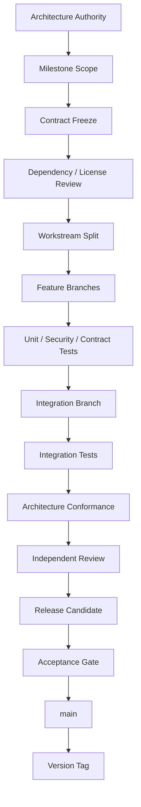

# Product Version and Development Roadmap Freeze

## Status and authority

**Freeze:** F-002 product-version and development roadmap  
**Approval state:** FROZEN  
**Current accepted application:** v0.1.0  
**Active reconciliation target:** v0.1.1  
**Following capability milestone:** v0.2.0 — NOT STARTED  
**Target first General Availability release:** v1.0.0

This document is authoritative for IPSP application-version meaning, milestone sequence, development gates, the bounded v1.0 definition, and tentative post-v1.0 direction. It works with the [F-002 Architecture Freeze](44_F002_ARCHITECTURE_FREEZE.md).

Where an older target roadmap conflicts, this freeze wins. Historical implementation and acceptance records retain their original meaning. Nothing in this roadmap implements a capability or authorizes v0.2 work.

## Version concepts

| Concept | Meaning | Example |
|---|---|---|
| Architecture Freeze | Approved architecture authority | F-002 |
| Application Version | Semantically versioned application release or milestone | v0.1.0, v0.1.1, v0.2.0, v1.0.0 |
| Development Phase / Work Package | Bounded reconciliation or implementation activity | F2-A, F2-B, milestone workstream |
| Contract Version | Compatibility version of an API or structured contract | /api/v1, Semantic Manifest, Domain Experience, metric definition |

F-002 does not mean application v2.0. An architecture freeze, application release, work package, and contract version may advance independently.

## Semantic-versioning rules

Application versions use MAJOR.MINOR.PATCH:

- before GA, **v0.x.0** is an accepted capability milestone;
- before GA, **v0.x.y** is a compatibility, correction, or architecture-reconciliation patch;
- **v1.0.0** is the first General Availability release;
- after GA, **v1.x** represents backward-compatible capability growth;
- **v2.0** is reserved for a meaningful breaking compatibility change.

Version identifiers are not decimal fractions. v0.10.0 follows v0.9.0 and does not imply v1.0.

## Current sequence and release state

```text
v0.1.0 — ACCEPTED FOUNDATION
  → v0.1.1 — F-002 ARCHITECTURE RECONCILIATION
  → v0.2.0 — DATA INGESTION, STORAGE & PROVENANCE
  → later capability milestones
  → v1.0.0 — FIRST GENERAL AVAILABILITY
```

Current state:

- v0.1.0 remains formally accepted;
- v0.1.1 is in reconciliation and is not accepted until its final gate passes;
- v0.2.0 is NOT STARTED and must not begin during F-002 reconciliation;
- no v0.2+ analytical capability is implied by frozen documentation;
- v1.0.0 is a target, not a current release.

## v0.1.1 reconciliation meaning

v0.1.1 aligns the accepted Phase 1 foundation, documentation, contracts, governance, and minimal compatibility surfaces with F-002. Its program includes:

- F-002 repository authority;
- neutral IPSP identity;
- provider-neutral synthetic terminology;
- Domain Experience contracts;
- Metric & Formula Registry contracts;
- Engine/License contracts;
- Composite/Cross-Domain contracts;
- Trust and Evidence Profile contracts;
- governed learning and OutcomeReconciliation contracts;
- anti-contamination rules;
- architecture flows;
- dependency and license governance;
- regression validation;
- minimal foundation-code reconciliation only after documentation phases are accepted.

v0.1.1 does not implement ingestion, profiling, semantic inference, modelling, simulation, Domain Experience execution, Cross-Domain execution, Finance execution, governed learning runtime, or LLM runtime.

## Frozen pre-v1.0 roadmap

| Version | Frozen milestone scope | Current status |
|---|---|---|
| v0.1.0 | Foundation / Security / Repository Shell | **FORMALLY ACCEPTED** |
| v0.1.1 | F-002 Architecture Reconciliation | **IN PROGRESS — NOT ACCEPTED** |
| v0.2.0 | Data Ingestion, Storage & Provenance | **NOT STARTED** |
| v0.3.0 | Deterministic Data Understanding & Relationships | **NOT STARTED** |
| v0.4.0 | Semantic Intelligence & Dataset Semantic Manifest | **NOT STARTED** |
| v0.5.0 | Metric & Formula Registry + Domain Experience Foundation | **NOT STARTED** |
| v0.6.0 | Capability Discovery + Engine/License Registry | **NOT STARTED** |
| v0.7.0 | Core Modelling + Model Lifecycle | **NOT STARTED** |
| v0.8.0 | Simulation Core + ScenarioIntentManifest + CompositeSimulationGraph foundation | **NOT STARTED** |
| v0.9.0 | Trust + Evidence + History + Comparison | **NOT STARTED** |
| v0.10.0 | Cross-Domain Composite Intelligence | **NOT STARTED** |
| v0.11.0 | Domain Intelligence Completion | **NOT STARTED** |
| v0.12.0 | Learning + Outcome Reconciliation Foundation | **NOT STARTED** |
| v0.13.0 | Local AI | **NOT STARTED** |
| v0.14.0 | Full Dynamic Product UI | **NOT STARTED** |
| v0.15.0 | v1.0 Release Candidate / Hardening | **NOT STARTED** |
| v1.0.0 | First General Availability release | **TARGET — NOT RELEASED** |

Milestone names define sequencing, not permission to skip contract freezes or acceptance gates.

## Bounded v1.0 definition

v1.0 means:

> the first complete, production-usable expression of the IPSP architecture.

It does not mean every future capability IPSP may ever support.

Expected v1.0 scope includes:

- secure local-first projects/workspaces;
- structured ingestion;
- dataset versioning and provenance;
- deterministic Data Understanding;
- Dataset Semantic Manifest;
- relationship and grain validation;
- Metric & Formula Registry;
- Domain Experience framework;
- baseline Marketing, Product, Sales, Customer Experience, Finance, Operations/Demand, and Generic/Custom experiences;
- Capability Discovery and responsible refusal;
- core statistical/ML modelling and forecasting;
- explainability;
- EngineRegistry and LicenseRegistry;
- OPEN_SOURCE_PREFERRED resolution;
- DATA_BASED, MIXED, and INTENT_BASED simulation;
- ScenarioIntentManifest;
- CompositeSimulationGraph;
- basic defensible Cross-Domain simulation;
- Monte Carlo where valid;
- Trust and separate Evidence Profiles;
- Scenario Library and Compare;
- Re-run and Reproduce;
- SimulationLearningStore;
- OutcomeReconciliation foundation;
- governed champion/challenger learning;
- optional local LLM assistance;
- PDF and Excel export;
- full capability-driven UI.

## Explicitly deferred post-v1.0 capabilities

The following are not mandatory blockers for v1.0 when their architecture boundaries remain preserved:

- advanced production causal workflows using DoWhy/EconML;
- full CVXPY/solver-backed decision optimization;
- automated Local LLM PEFT/LoRA lifecycle;
- Remote and Hybrid LLM execution;
- PUBLIC_WEB evidence;
- APPROVED_CONNECTORS and enterprise business/warehouse connectors;
- enterprise identity and advanced organization policy;
- PostgreSQL control plane;
- Redis, Celery, Kubernetes, object storage, distributed or multi-node workers;
- specialized QuantLib instrument pricing and advanced Quant Finance.

These deferrals do not permit a partial v1.0 to bypass mandatory security, provenance, Trust, reproducibility, licensing, or responsible-refusal gates.

## Tentative post-v1.0 direction

This direction is strategic and tentative, not an immutable implementation commitment:

| Version | Direction | Representative scope |
|---|---|---|
| v1.1 | Advanced Learning & Decision Intelligence | stronger reconciliation, drift, governed retraining, local semantic memory, optional PEFT/LoRA evaluation |
| v1.2 | Causal & Optimization Intelligence | DoWhy, EconML, CVXPY, OSQP/SCS, budget/resource/capacity optimization |
| v1.3 | External Intelligence | PUBLIC_WEB evidence, approved external providers, Remote/Hybrid LLM, evidence research |
| v1.4 | Enterprise Integrations | business/warehouse connectors, enterprise identity, stronger organization policy |
| v1.5 | Enterprise Scale | optional PostgreSQL, distributed workers, object-like storage, horizontal scaling |

v2.0 is not pre-assigned to any feature set.

## Domain Experience version compatibility

The architecture must permit future independent Domain Experience versioning:

```text
IPSP Core              1.x
Marketing Experience   x.y
Product Experience     x.y
Sales Experience       x.y
CX Experience          x.y
Finance Experience     x.y
Operations Experience  x.y
```

This is a compatibility requirement, not a claim that independent packages or deployment currently exist. Application compatibility rules and each experience contract will determine eligible version combinations.

## Development flow



Kedar remains the integration owner and final merge authority. Contributors work only within assigned workstreams and never promote a feature branch to integration or main. Branch PASS is necessary but does not establish milestone PASS.

## Required pre-implementation freezes

Before implementation of every milestone, the integration owner must approve:

1. functional contract;
2. data/schema contract;
3. API/interface contract;
4. acceptance contract;
5. dependency/license contract.

The milestone must also identify exact base SHA, merge target, owners, owned/shared/forbidden paths, migration owner, dependency owner, stop conditions, branch gate, post-merge integration gate, and milestone acceptance gate.

If a frozen shared contract must change, work stops with CONTRACT CHANGE REQUIRED. Migration, dependency, shared-file, security-authority, or architecture changes likewise require their explicit owner.

## F-002 reconciliation program gates

The F-002 work packages execute sequentially:

| Work package | Purpose | Gate rule |
|---|---|---|
| F2-A | Architecture authority and roadmap freeze | Must pass independent review before F2-B |
| F2-B | Product/core architecture/structure reconciliation | Requires accepted F2-A SHA |
| F2-C | Data/semantics/metrics/domain contracts | Requires accepted F2-B SHA |
| F2-D | Capability/engine/license/model contracts | Requires accepted F2-C SHA |
| F2-E | Simulation/composite/Finance/Trust/evidence contracts | Requires accepted F2-D SHA |
| F2-F | Learning/outcome/LLM/evidence-access contracts | Requires accepted F2-E SHA |
| F2-G | UI/API/storage/jobs/security/operations contracts | Requires accepted F2-F SHA |
| F2-H | Flows/tests/acceptance/governance/instructions | Requires accepted F2-G SHA |
| F2-I | Minimal v0.1.1 production reconciliation | Requires accepted F2-H SHA |
| F2-J | Independent final acceptance audit | Requires accepted F2-I SHA |

No phase automatically starts its successor. Only after F2-J PASS may v0.2 contract-freeze preparation be authorized. v0.2 implementation requires its own accepted contracts and implementation prompt.

## Related authority

- [F-002 Architecture Freeze](44_F002_ARCHITECTURE_FREEZE.md)
- [Scope Freeze](00_SCOPE_FREEZE.md)
- [Decision Log](32_DECISION_LOG.md)
- [Implementation Progress](31_IMPLEMENTATION_PROGRESS.md)
- [Parallel Development Workflow](41_PARALLEL_DEVELOPMENT_WORKFLOW.md)
- [Active Workstreams](42_ACTIVE_WORKSTREAMS.md)
