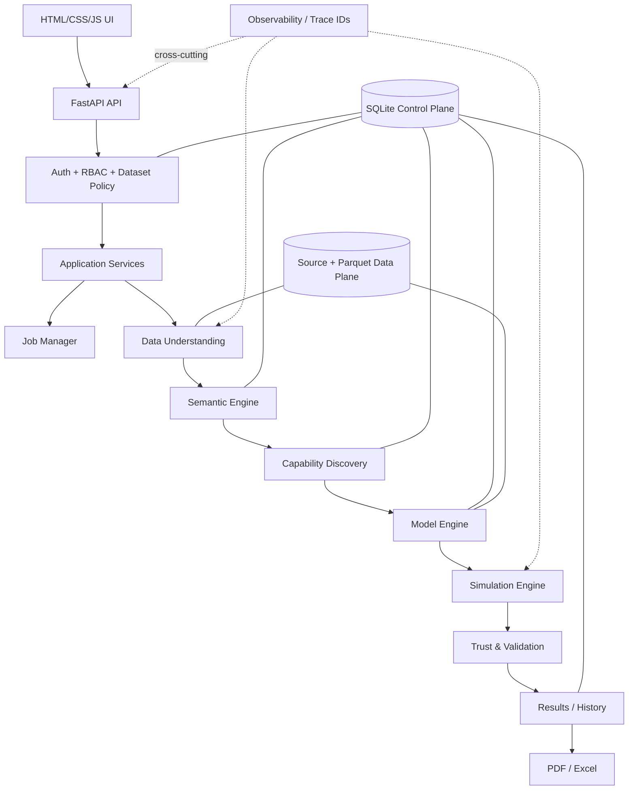

# Flow 01 — System Architecture

```mermaid
flowchart TD
  UI[HTML/CSS/JS UI] --> API[FastAPI API]
  API --> AUTH[Auth + RBAC + Dataset Policy]
  AUTH --> APP[Application Services]
  APP --> JOB[Job Manager]
  APP --> DU[Data Understanding]
  DU --> SEM[Semantic Engine]
  SEM --> CAP[Capability Discovery]
  CAP --> MOD[Model Engine]
  MOD --> SIM[Simulation Engine]
  SIM --> TRUST[Trust & Validation]
  TRUST --> RES[Results / History]
  RES --> REP[PDF / Excel]
  DB[(SQLite Control Plane)] --- AUTH
  DB --- SEM
  DB --- CAP
  DB --- MOD
  DB --- RES
  DATA[(Source + Parquet Data Plane)] --- DU
  DATA --- MOD
  OBS[Observability / Trace IDs] -.cross-cutting.-> API
  OBS -.-> DU
  OBS -.-> SIM
```
