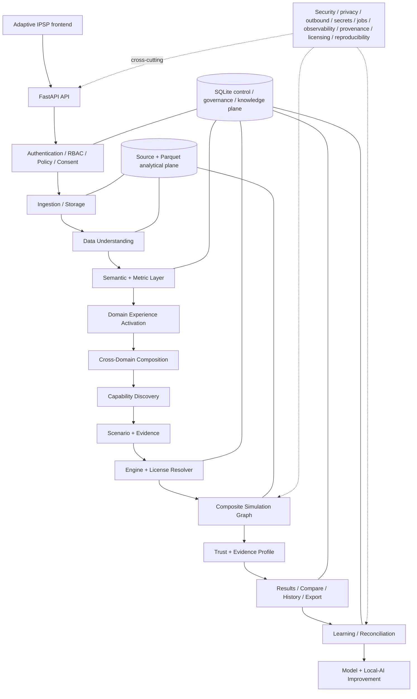

# Flow 01 — System Architecture

```mermaid
flowchart TD
  UI[Adaptive IPSP frontend] --> API[FastAPI API]
  API --> AUTH[Authentication / RBAC / Policy / Consent]
  AUTH --> ING[Ingestion / Storage]
  ING --> DU[Data Understanding]
  DU --> SEM[Semantic + Metric Layer]
  SEM --> DOM[Domain Experience Activation]
  DOM --> CROSS[Cross-Domain Composition]
  CROSS --> CAP[Capability Discovery]
  CAP --> INTENT[Scenario + Evidence]
  INTENT --> RESOLVE[Engine + License Resolver]
  RESOLVE --> GRAPH[Composite Simulation Graph]
  GRAPH --> TE[Trust + Evidence Profile]
  TE --> RESULT[Results / Compare / History / Export]
  RESULT --> LEARN[Learning / Reconciliation]
  LEARN --> IMPROVE[Model + Local-AI Improvement]

  DB[(SQLite control / governance / knowledge plane)] --- AUTH
  DB --- SEM
  DB --- RESOLVE
  DB --- RESULT
  DB --- LEARN
  DATA[(Source + Parquet analytical plane)] --- ING
  DATA --- DU
  DATA --- GRAPH
  X[Security / privacy / outbound / secrets / jobs / observability / provenance / licensing / reproducibility] -. cross-cutting .-> API
  X -.-> GRAPH
  X -.-> LEARN
```
