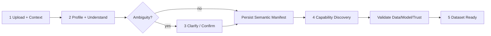

# Flow 02 — Dataset Onboarding

```mermaid
flowchart LR
  A[1 Upload + Context] --> B[2 Profile + Understand]
  B --> C{Ambiguity?}
  C -- yes --> D[3 Clarify / Confirm]
  C -- no --> E[Persist Semantic Manifest]
  D --> E
  E --> F[4 Capability Discovery]
  F --> G[Validate Data/Model/Trust]
  G --> H[5 Dataset Ready]
```
