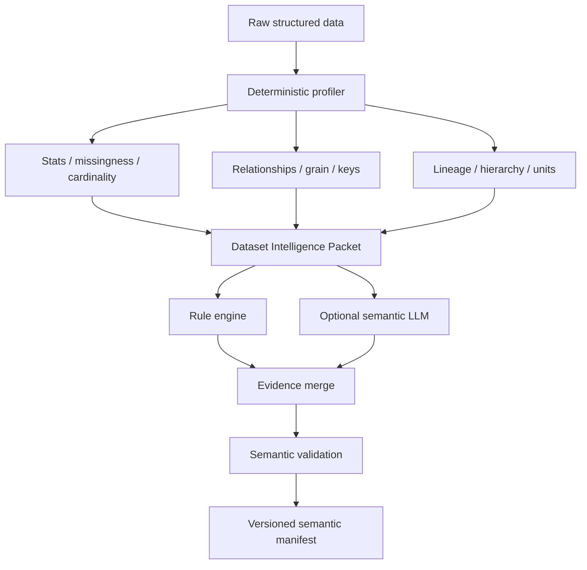

# Flow 03 — Data Intelligence Packet

```mermaid
flowchart TD
  RAW[Raw structured data] --> PROF[Deterministic profiler]
  PROF --> STATS[Stats / missingness / cardinality]
  PROF --> REL[Relationships / grain / keys]
  PROF --> LIN[Lineage / hierarchy / units]
  STATS --> PACK[Dataset Intelligence Packet]
  REL --> PACK
  LIN --> PACK
  PACK --> RULES[Rule engine]
  PACK --> LLM[Optional semantic LLM]
  RULES --> MERGE[Evidence merge]
  LLM --> MERGE
  MERGE --> VAL[Semantic validation]
  VAL --> MAN[Versioned semantic manifest]
```
