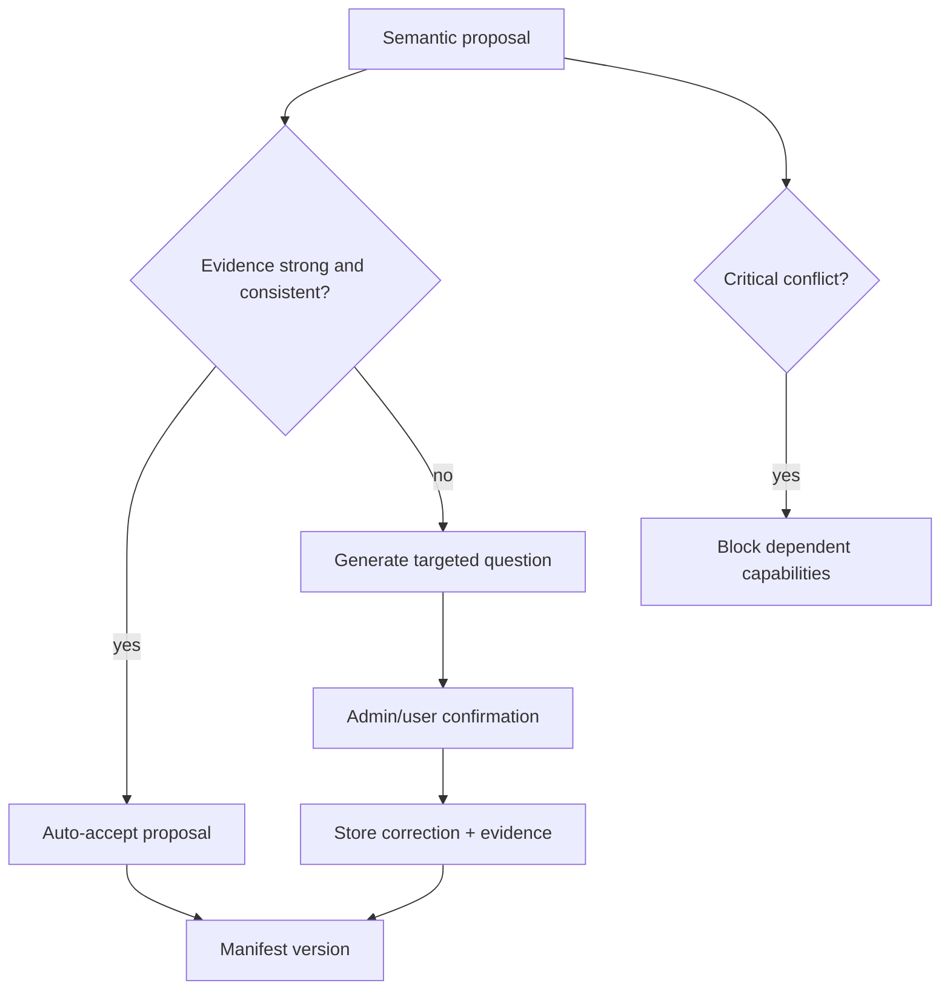

# Flow 04 — Semantic Clarification

```mermaid
flowchart TD
  P[Semantic proposal] --> V{Evidence strong and consistent?}
  V -- yes --> A[Auto-accept proposal]
  V -- no --> Q[Generate targeted question]
  Q --> U[Admin/user confirmation]
  U --> C[Store correction + evidence]
  A --> M[Manifest version]
  C --> M
  P --> X{Critical conflict?}
  X -- yes --> B[Block dependent capabilities]
```
