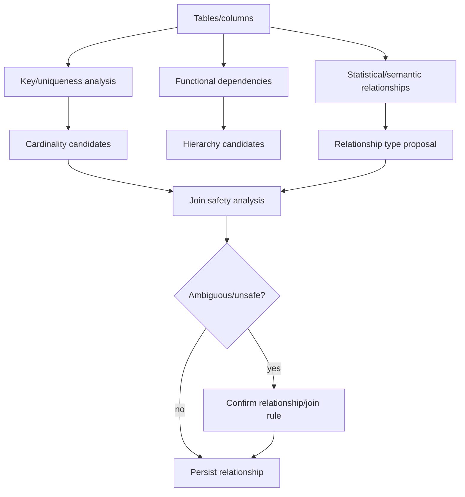

# Flow 05 — Relationship Discovery

```mermaid
flowchart TD
  T[Tables/columns] --> K[Key/uniqueness analysis]
  T --> F[Functional dependencies]
  T --> R[Statistical/semantic relationships]
  K --> C[Cardinality candidates]
  F --> H[Hierarchy candidates]
  R --> TY[Relationship type proposal]
  C --> J[Join safety analysis]
  TY --> J
  J --> Q{Ambiguous/unsafe?}
  Q -- yes --> U[Confirm relationship/join rule]
  Q -- no --> P[Persist relationship]
  U --> P
```
