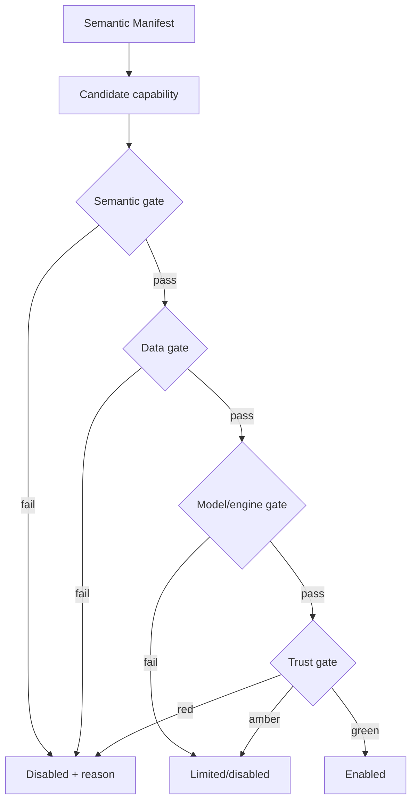

# Flow 06 — Capability Discovery

```mermaid
flowchart TD
  MAN[Semantic Manifest] --> C[Candidate capability]
  C --> S{Semantic gate}
  S -- fail --> OFF[Disabled + reason]
  S -- pass --> D{Data gate}
  D -- fail --> OFF
  D -- pass --> M{Model/engine gate}
  M -- fail --> LIM[Limited/disabled]
  M -- pass --> T{Trust gate}
  T -- red --> OFF
  T -- amber --> LIM
  T -- green --> ON[Enabled]
```
