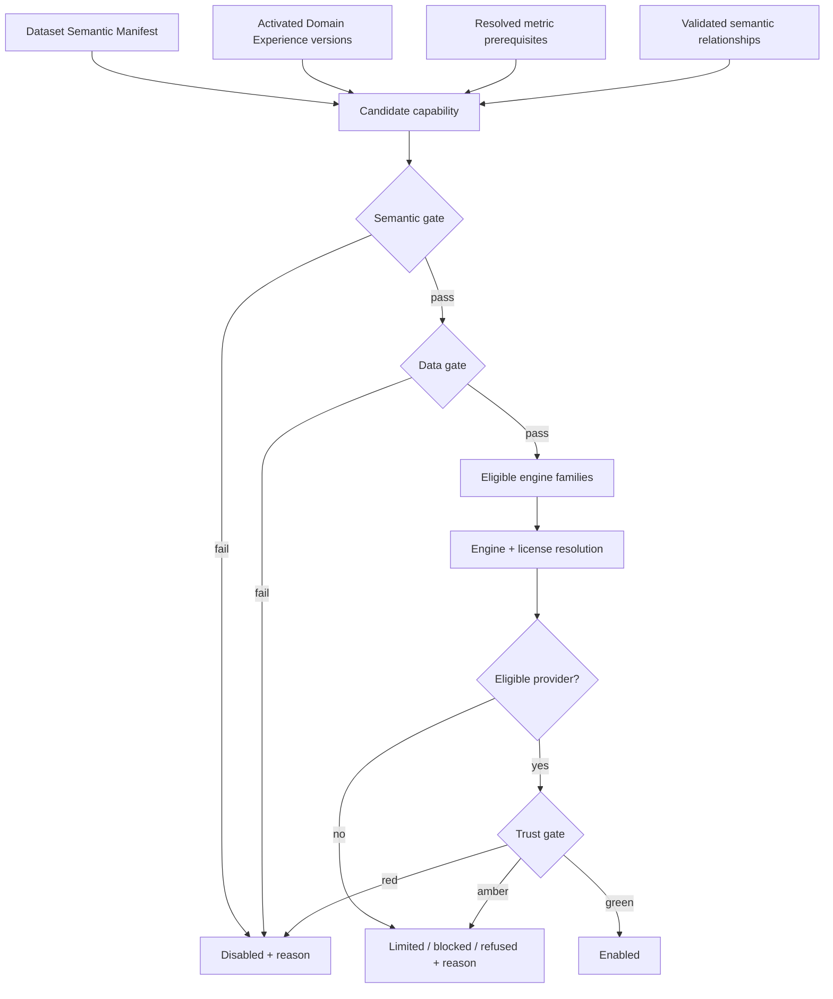

# Flow 06 — Capability Discovery

```mermaid
flowchart TD
  MAN[Dataset Semantic Manifest] --> C[Candidate capability]
  DOM[Activated Domain Experience versions] --> C
  MET[Resolved metric prerequisites] --> C
  REL[Validated semantic relationships] --> C
  C --> S{Semantic gate}
  S -- fail --> OFF[Disabled + reason]
  S -- pass --> D{Data gate}
  D -- fail --> OFF
  D -- pass --> FAM[Eligible engine families]
  FAM --> RES[Engine + license resolution]
  RES --> M{Eligible provider?}
  M -- no --> LIM[Limited / blocked / refused + reason]
  M -- yes --> T{Trust gate}
  T -- red --> OFF
  T -- amber --> LIM
  T -- green --> ON[Enabled]
```
