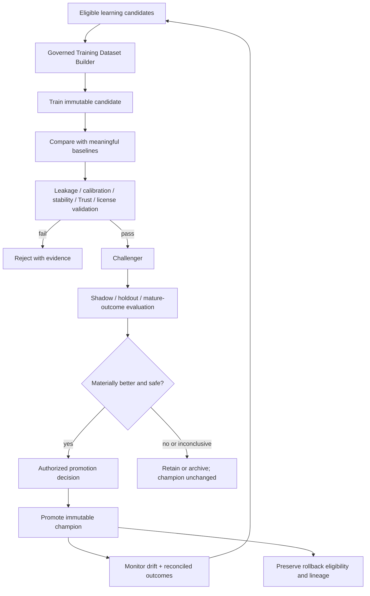

# Flow 07 — Model Lifecycle

```mermaid
flowchart TD
  EVENT[Eligible learning candidates] --> BUILD[Governed Training Dataset Builder]
  BUILD --> TRAIN[Train immutable candidate]
  TRAIN --> BASE[Compare with meaningful baselines]
  BASE --> V[Leakage / calibration / stability / Trust / license validation]
  V -->|fail| REJ[Reject with evidence]
  V -->|pass| CH[Challenger]
  CH --> SH[Shadow / holdout / mature-outcome evaluation]
  SH --> BET{Materially better and safe?}
  BET -- yes --> DEC[Authorized promotion decision]
  BET -- no or inconclusive --> ARC[Retain or archive; champion unchanged]
  DEC --> PRO[Promote immutable champion]
  PRO --> MON[Monitor drift + reconciled outcomes]
  MON --> EVENT
  PRO --> ROLL[Preserve rollback eligibility and lineage]
```
