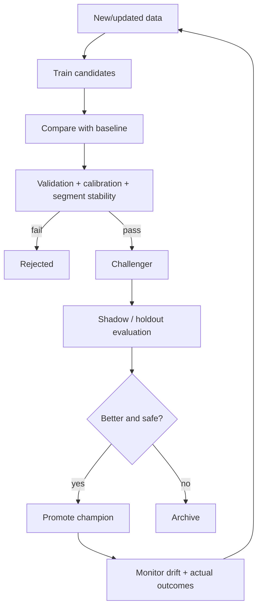

# Flow 07 — Model Lifecycle

```mermaid
flowchart TD
  DATA[New/updated data] --> TRAIN[Train candidates]
  TRAIN --> BASE[Compare with baseline]
  BASE --> V[Validation + calibration + segment stability]
  V -->|fail| REJ[Rejected]
  V -->|pass| CH[Challenger]
  CH --> SH[Shadow / holdout evaluation]
  SH --> BET{Better and safe?}
  BET -- yes --> PRO[Promote champion]
  BET -- no --> ARC[Archive]
  PRO --> MON[Monitor drift + actual outcomes]
  MON --> DATA
```
