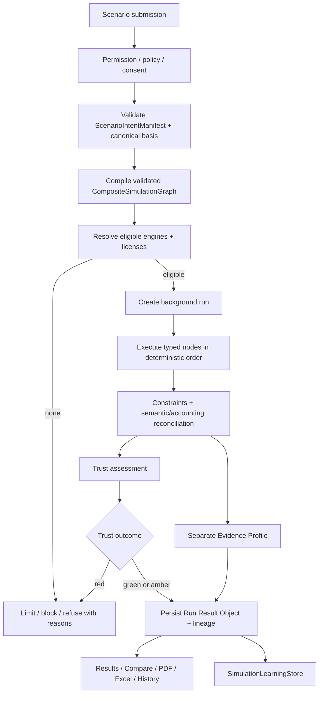

# Flow 08 — Simulation Execution

```mermaid
flowchart TD
  U[Scenario submission] --> P[Permission / policy / consent]
  P --> I[Validate ScenarioIntentManifest + canonical basis]
  I --> G[Compile validated CompositeSimulationGraph]
  G --> R[Resolve eligible engines + licenses]
  R -->|none| REFUSE[Limit / block / refuse with reasons]
  R -->|eligible| J[Create background run]
  J --> E[Execute typed nodes in deterministic order]
  E --> REC[Constraints + semantic/accounting reconciliation]
  REC --> T[Trust assessment]
  REC --> EP[Separate Evidence Profile]
  T --> O{Trust outcome}
  O -->|red| REFUSE
  O -->|green or amber| SAVE[Persist Run Result Object + lineage]
  EP --> SAVE
  SAVE --> UI[Results / Compare / PDF / Excel / History]
  SAVE --> L[SimulationLearningStore]
```
