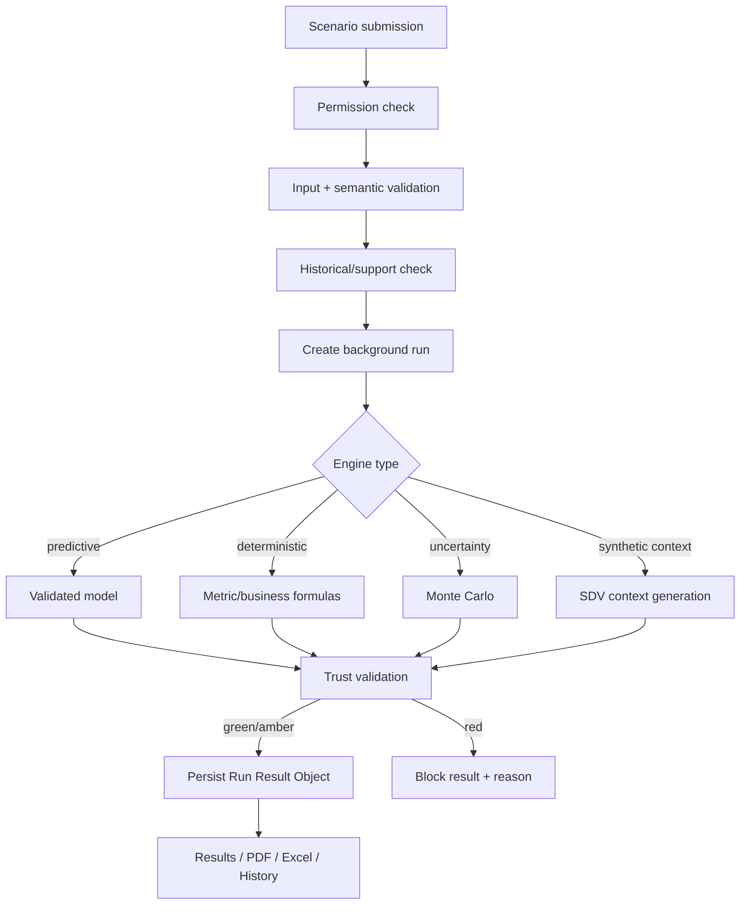

# Flow 08 — Simulation Execution

```mermaid
flowchart TD
  U[Scenario submission] --> P[Permission check]
  P --> I[Input + semantic validation]
  I --> S[Historical/support check]
  S --> J[Create background run]
  J --> E{Engine type}
  E -->|predictive| ML[Validated model]
  E -->|deterministic| DET[Metric/business formulas]
  E -->|uncertainty| MC[Monte Carlo]
  E -->|synthetic context| SDV[SDV context generation]
  ML --> T[Trust validation]
  DET --> T
  MC --> T
  SDV --> T
  T -->|green/amber| SAVE[Persist Run Result Object]
  T -->|red| BLOCK[Block result + reason]
  SAVE --> UI[Results / PDF / Excel / History]
```
