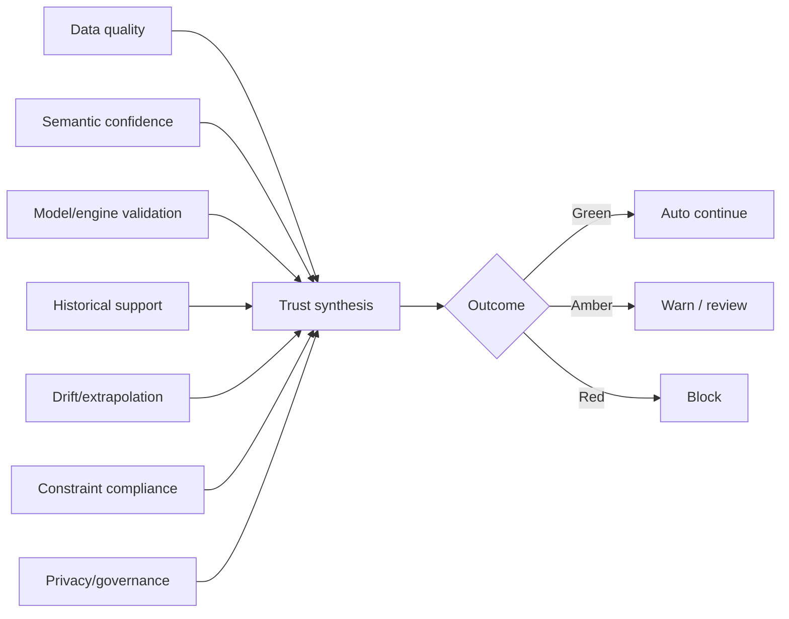

# Flow 09 — Trust & Validation

```mermaid
flowchart LR
  D[Data quality] --> TS[Trust synthesis]
  S[Semantic confidence] --> TS
  M[Model/engine validation] --> TS
  H[Historical support] --> TS
  R[Drift/extrapolation] --> TS
  C[Constraint compliance] --> TS
  G[Privacy/governance] --> TS
  TS --> O{Outcome}
  O -->|Green| A[Auto continue]
  O -->|Amber| W[Warn / review]
  O -->|Red| B[Block]
```
