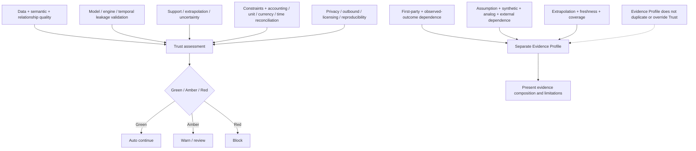

# Flow 09 — Trust & Validation

```mermaid
flowchart TD
  D[Data + semantic + relationship quality] --> TS[Trust assessment]
  M[Model / engine / temporal leakage validation] --> TS
  R[Support / extrapolation / uncertainty] --> TS
  C[Constraints + accounting / unit / currency / time reconciliation] --> TS
  G[Privacy / outbound / licensing / reproducibility] --> TS
  TS --> O{Green / Amber / Red}
  O -->|Green| A[Auto continue]
  O -->|Amber| W[Warn / review]
  O -->|Red| B[Block]

  E1[First-party + observed-outcome dependence] --> EP[Separate Evidence Profile]
  E2[Assumption + synthetic + analog + external dependence] --> EP
  E3[Extrapolation + freshness + coverage] --> EP
  EP --> SHOW[Present evidence composition and limitations]
  NOTE[Evidence Profile does not duplicate or override Trust] -.-> EP
```
