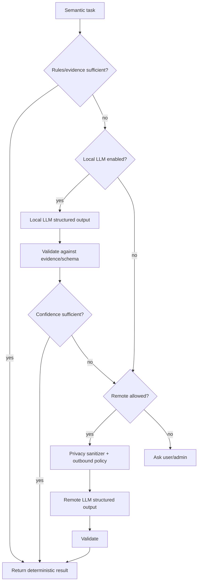

# Flow 10 — LLM Routing

```mermaid
flowchart TD
  T[Semantic task] --> R{Rules/evidence sufficient?}
  R -- yes --> DONE[Return deterministic result]
  R -- no --> L{Local LLM enabled?}
  L -- yes --> LOC[Local LLM structured output]
  L -- no --> REMQ{Remote allowed?}
  LOC --> VAL[Validate against evidence/schema]
  VAL --> C{Confidence sufficient?}
  C -- yes --> DONE
  C -- no --> REMQ
  REMQ -- yes --> PRIV[Privacy sanitizer + outbound policy]
  PRIV --> REM[Remote LLM structured output]
  REM --> VAL2[Validate]
  VAL2 --> DONE
  REMQ -- no --> ASK[Ask user/admin]
```
