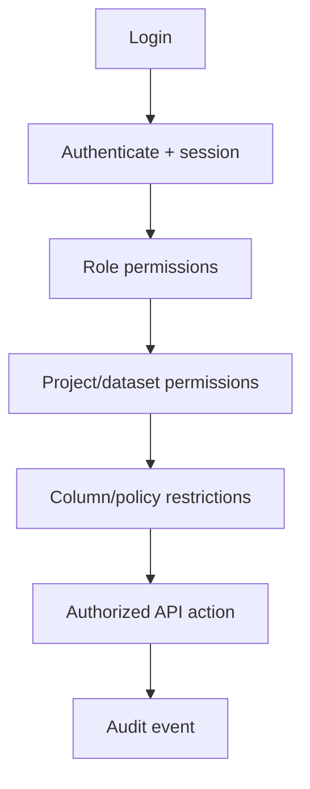

# Flow 11 — Authentication / Authorization

```mermaid
flowchart TD
  LOGIN[Login] --> AUTH[Authenticate + session]
  AUTH --> ROLE[Role permissions]
  ROLE --> DS[Project/dataset permissions]
  DS --> COL[Column/policy restrictions]
  COL --> API[Authorized API action]
  API --> AUD[Audit event]
```
