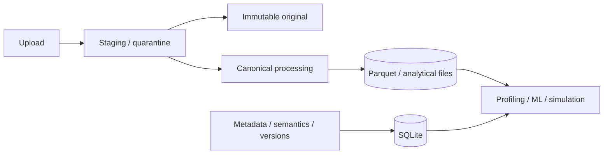

# Flow 12 — Storage Planes

```mermaid
flowchart LR
  UP[Upload] --> STG[Staging / quarantine]
  STG --> ORIG[Immutable original]
  STG --> CAN[Canonical processing]
  CAN --> PARQ[(Parquet / analytical files)]
  META[Metadata / semantics / versions] --> SQL[(SQLite)]
  PARQ --> PROF[Profiling / ML / simulation]
  SQL --> PROF
```
