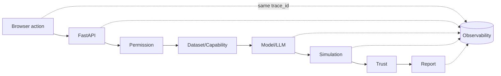

# Flow 13 — Observability Trace

```mermaid
flowchart LR
  B[Browser action] --> A[FastAPI]
  A --> P[Permission]
  P --> D[Dataset/Capability]
  D --> M[Model/LLM]
  M --> S[Simulation]
  S --> T[Trust]
  T --> R[Report]
  B -. same trace_id .-> LOG[(Observability)]
  A -.-> LOG
  M -.-> LOG
  S -.-> LOG
  R -.-> LOG
```
