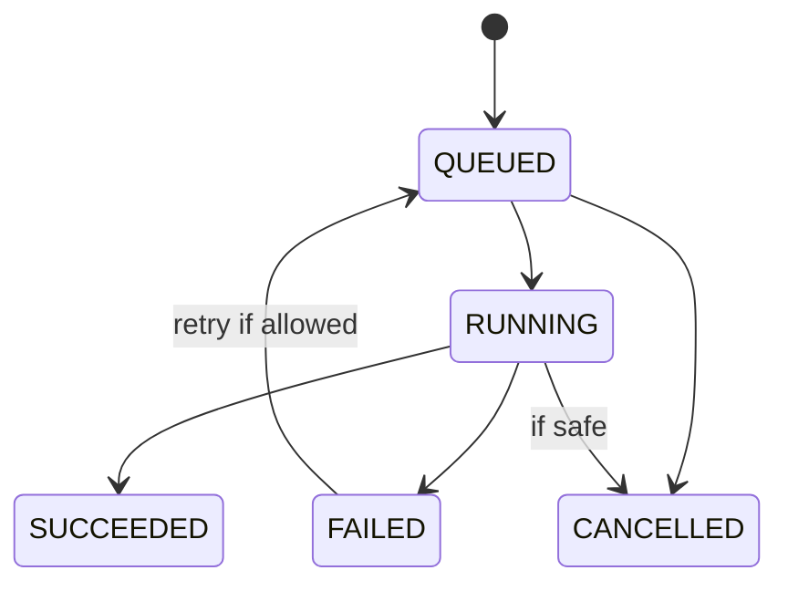

# Flow 15 — Background Jobs

```mermaid
stateDiagram-v2
  [*] --> QUEUED
  QUEUED --> RUNNING
  RUNNING --> SUCCEEDED
  RUNNING --> FAILED
  QUEUED --> CANCELLED
  RUNNING --> CANCELLED: if safe
  FAILED --> QUEUED: retry if allowed
```
