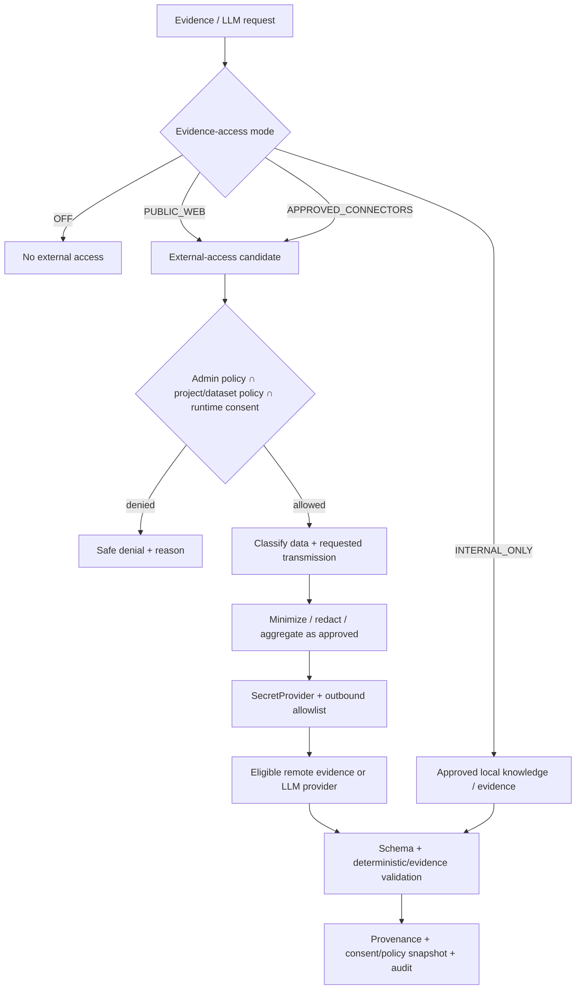

# Flow 16 — Evidence Access / Consent / Remote LLM

```mermaid
flowchart TD
  REQ[Evidence / LLM request] --> MODE{Evidence-access mode}
  MODE -->|OFF| DENY[No external access]
  MODE -->|INTERNAL_ONLY| INTERNAL[Approved local knowledge / evidence]
  MODE -->|PUBLIC_WEB| EXT[External-access candidate]
  MODE -->|APPROVED_CONNECTORS| EXT
  EXT --> POL{Admin policy ∩ project/dataset policy ∩ runtime consent}
  POL -- denied --> DENY2[Safe denial + reason]
  POL -- allowed --> CLASS[Classify data + requested transmission]
  CLASS --> SAN[Minimize / redact / aggregate as approved]
  SAN --> SEC[SecretProvider + outbound allowlist]
  SEC --> SEND[Eligible remote evidence or LLM provider]
  SEND --> VAL[Schema + deterministic/evidence validation]
  INTERNAL --> VAL
  VAL --> AUD[Provenance + consent/policy snapshot + audit]
```
