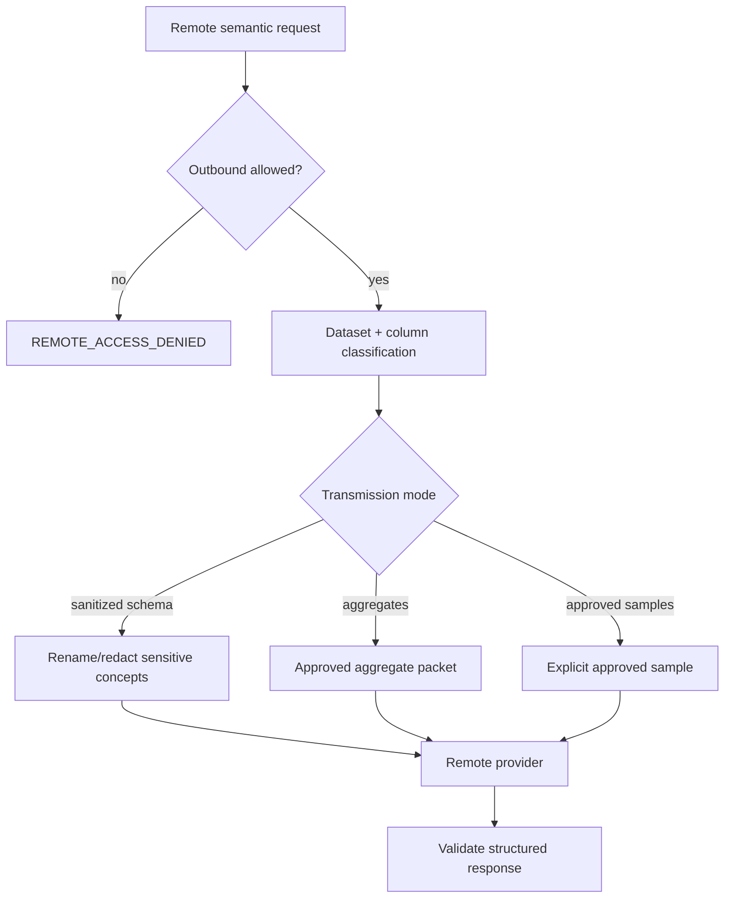

# Flow 16 — Privacy / Remote LLM

```mermaid
flowchart TD
  REQ[Remote semantic request] --> POL{Outbound allowed?}
  POL -- no --> DENY[REMOTE_ACCESS_DENIED]
  POL -- yes --> CLASS[Dataset + column classification]
  CLASS --> MODE{Transmission mode}
  MODE -->|sanitized schema| SAN[Rename/redact sensitive concepts]
  MODE -->|aggregates| AGG[Approved aggregate packet]
  MODE -->|approved samples| SMP[Explicit approved sample]
  SAN --> SEND[Remote provider]
  AGG --> SEND
  SMP --> SEND
  SEND --> VAL[Validate structured response]
```
