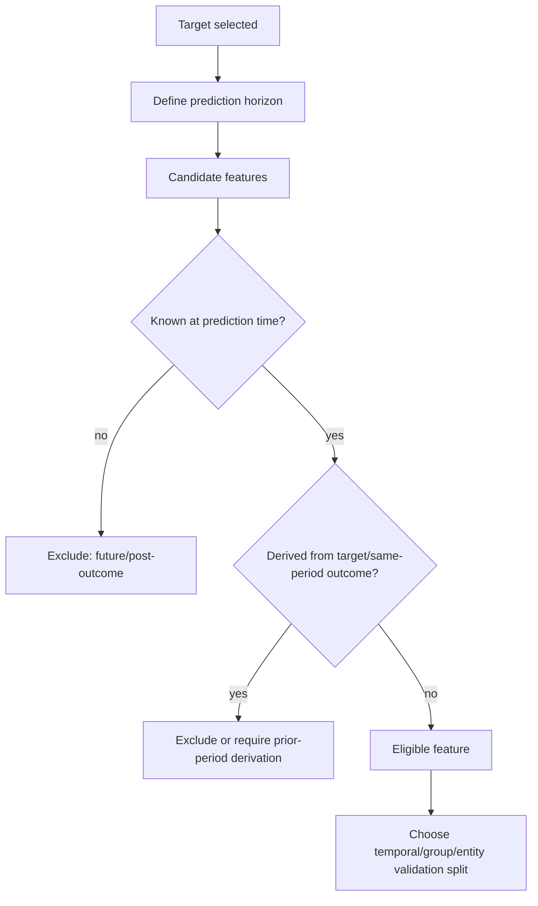

# Flow 17 — Prediction Horizon / Leakage

```mermaid
flowchart TD
  TARGET[Target selected] --> H[Define prediction horizon]
  H --> F[Candidate features]
  F --> AV{Known at prediction time?}
  AV -- no --> DROP[Exclude: future/post-outcome]
  AV -- yes --> LIN{Derived from target/same-period outcome?}
  LIN -- yes --> DROP2[Exclude or require prior-period derivation]
  LIN -- no --> OK[Eligible feature]
  OK --> SPLIT[Choose temporal/group/entity validation split]
```
