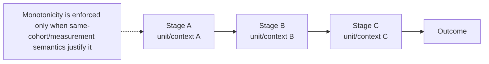

# Flow 18 — Journey / Stage Metric Graph

```mermaid
flowchart LR
  V[Stage A\nunit/context A] --> P[Stage B\nunit/context B]
  P --> C[Stage C\nunit/context C]
  C --> O[Outcome]
  NOTE[Monotonicity is enforced only when same-cohort/measurement semantics justify it] -.-> V
```
