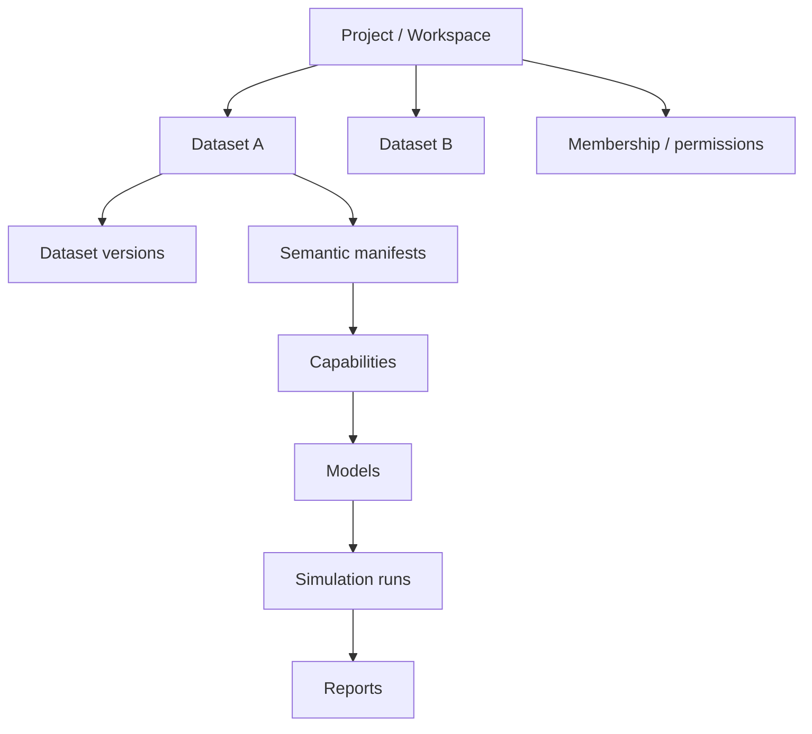

# Flow 19 — Workspace Hierarchy

```mermaid
flowchart TD
  P[Project / Workspace] --> D1[Dataset A]
  P --> D2[Dataset B]
  D1 --> V1[Dataset versions]
  D1 --> SM[Semantic manifests]
  SM --> C[Capabilities]
  C --> M[Models]
  M --> R[Simulation runs]
  R --> REP[Reports]
  P --> PERM[Membership / permissions]
```
