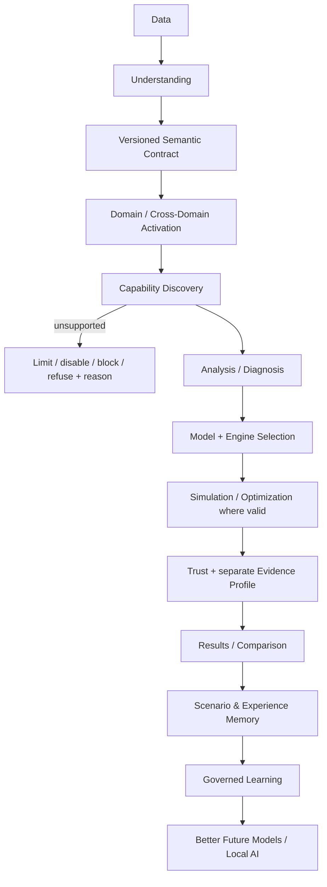

# Flow 20 — F-002 Canonical End-to-End Lifecycle

```mermaid
flowchart TD
  DATA[Data] --> UNDER[Understanding]
  UNDER --> SEM[Versioned Semantic Contract]
  SEM --> DOM[Domain / Cross-Domain Activation]
  DOM --> CAP[Capability Discovery]
  CAP -->|unsupported| REFUSE[Limit / disable / block / refuse + reason]
  CAP --> ANA[Analysis / Diagnosis]
  ANA --> SEL[Model + Engine Selection]
  SEL --> SIM[Simulation / Optimization where valid]
  SIM --> TE[Trust + separate Evidence Profile]
  TE --> RES[Results / Comparison]
  RES --> MEM[Scenario & Experience Memory]
  MEM --> LEARN[Governed Learning]
  LEARN --> FUTURE[Better Future Models / Local AI]
```
