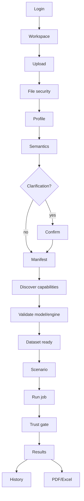

# Flow 20 — End-to-End Lifecycle

```mermaid
flowchart TD
  L[Login] --> W[Workspace]
  W --> U[Upload]
  U --> SEC[File security]
  SEC --> PROF[Profile]
  PROF --> SEM[Semantics]
  SEM --> Q{Clarification?}
  Q -- yes --> CONF[Confirm]
  Q -- no --> MAN[Manifest]
  CONF --> MAN
  MAN --> CAP[Discover capabilities]
  CAP --> MOD[Validate model/engine]
  MOD --> READY[Dataset ready]
  READY --> SCEN[Scenario]
  SCEN --> RUN[Run job]
  RUN --> TRUST[Trust gate]
  TRUST --> RES[Results]
  RES --> HIST[History]
  RES --> EXP[PDF/Excel]
```
