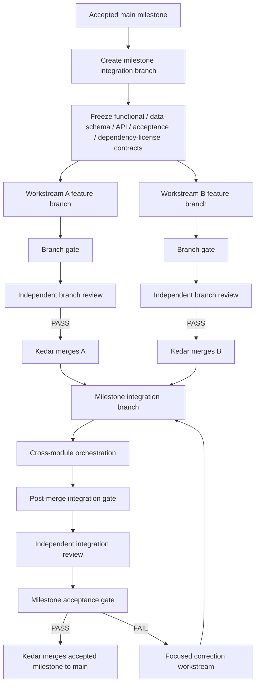

# Flow 21 — Parallel Development

## Authority

- Contributors push only to their assigned feature branches.
- Kedar owns merges, conflict resolution, integration ordering, milestone finalization, and promotion to `main`.
- `main` contains accepted milestone states only.

See [Parallel Development Workflow](../docs/41_PARALLEL_DEVELOPMENT_WORKFLOW.md).
