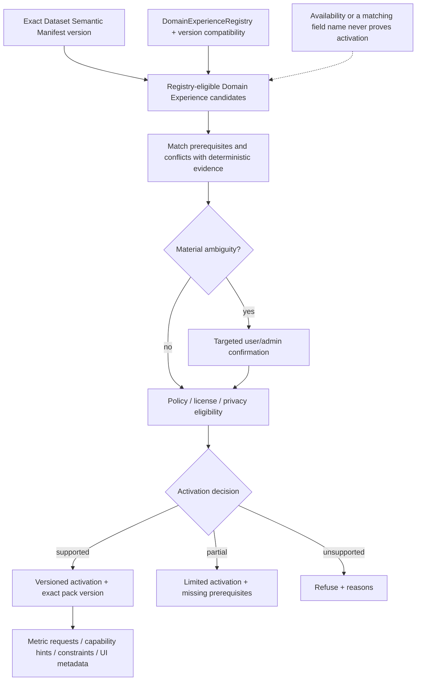

# Flow 22 — Domain Experience Activation

```mermaid
flowchart TD
  MAN[Exact Dataset Semantic Manifest version] --> CAND[Registry-eligible Domain Experience candidates]
  REG[DomainExperienceRegistry + version compatibility] --> CAND
  CAND --> EVID[Match prerequisites and conflicts with deterministic evidence]
  EVID --> Q{Material ambiguity?}
  Q -- yes --> CONF[Targeted user/admin confirmation]
  Q -- no --> POLICY[Policy / license / privacy eligibility]
  CONF --> POLICY
  POLICY --> DEC{Activation decision}
  DEC -->|supported| ACTIVE[Versioned activation + exact pack version]
  DEC -->|partial| LIMITED[Limited activation + missing prerequisites]
  DEC -->|unsupported| REFUSE[Refuse + reasons]
  ACTIVE --> OUT[Metric requests / capability hints / constraints / UI metadata]
  NOTE[Availability or a matching field name never proves activation] -.-> CAND
```
