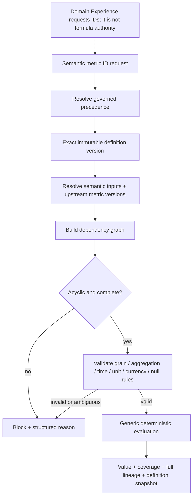

# Flow 23 — Metric & Formula Resolution

```mermaid
flowchart TD
  REQ[Semantic metric ID request] --> PREC[Resolve governed precedence]
  PREC --> DEF[Exact immutable definition version]
  DEF --> INPUT[Resolve semantic inputs + upstream metric versions]
  INPUT --> GRAPH[Build dependency graph]
  GRAPH --> CYCLE{Acyclic and complete?}
  CYCLE -- no --> BLOCK[Block + structured reason]
  CYCLE -- yes --> VALID[Validate grain / aggregation / time / unit / currency / null rules]
  VALID -->|invalid or ambiguous| BLOCK
  VALID -->|valid| EVAL[Generic deterministic evaluation]
  EVAL --> OUT[Value + coverage + full lineage + definition snapshot]
  PACK[Domain Experience requests IDs; it is not formula authority] -.-> REQ
```
