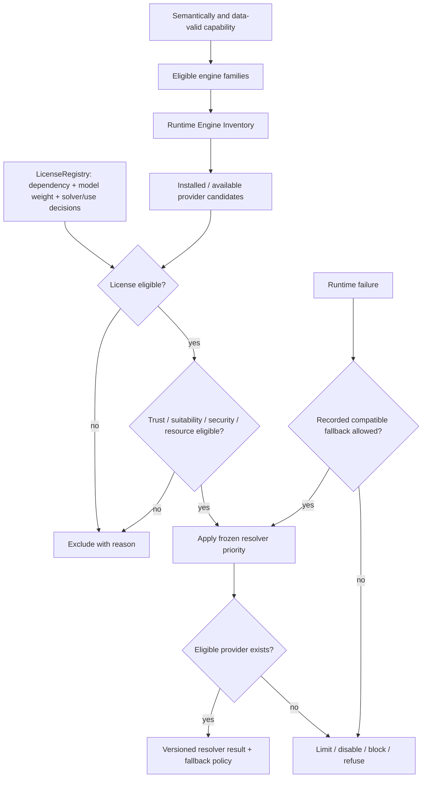

# Flow 24 — Engine & License Resolution

```mermaid
flowchart TD
  CAP[Semantically and data-valid capability] --> FAM[Eligible engine families]
  FAM --> INV[Runtime Engine Inventory]
  INV --> CAND[Installed / available provider candidates]
  LIC[LicenseRegistry: dependency + model weight + solver/use decisions] --> GATE{License eligible?}
  CAND --> GATE
  GATE -- no --> EXCLUDE[Exclude with reason]
  GATE -- yes --> TRUST{Trust / suitability / security / resource eligible?}
  TRUST -- no --> EXCLUDE
  TRUST -- yes --> ORDER[Apply frozen resolver priority]
  ORDER --> PICK{Eligible provider exists?}
  PICK -- yes --> RESULT[Versioned resolver result + fallback policy]
  PICK -- no --> REFUSE[Limit / disable / block / refuse]
  FAIL[Runtime failure] --> FALLBACK{Recorded compatible fallback allowed?}
  FALLBACK -- yes --> ORDER
  FALLBACK -- no --> REFUSE
```
