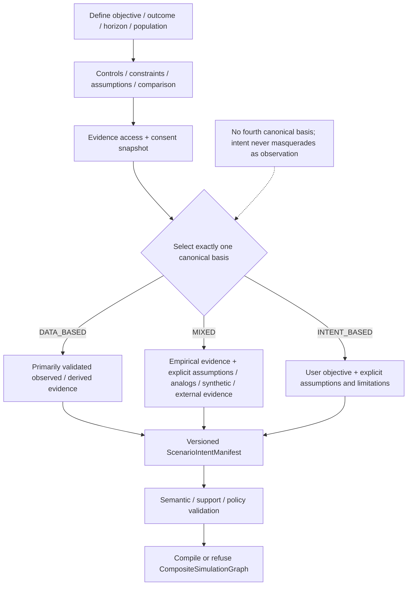

# Flow 25 — Scenario Intent and Simulation Bases

```mermaid
flowchart TD
  DEFINE[Define objective / outcome / horizon / population] --> CONFIG[Controls / constraints / assumptions / comparison]
  CONFIG --> EVID[Evidence access + consent snapshot]
  EVID --> BASIS{Select exactly one canonical basis}
  BASIS -->|DATA_BASED| DATA[Primarily validated observed / derived evidence]
  BASIS -->|MIXED| MIX[Empirical evidence + explicit assumptions / analogs / synthetic / external evidence]
  BASIS -->|INTENT_BASED| INTENT[User objective + explicit assumptions and limitations]
  DATA --> MAN[Versioned ScenarioIntentManifest]
  MIX --> MAN
  INTENT --> MAN
  MAN --> VALID[Semantic / support / policy validation]
  VALID --> COMPILE[Compile or refuse CompositeSimulationGraph]
  NOTE[No fourth canonical basis; intent never masquerades as observation] -.-> BASIS
```
