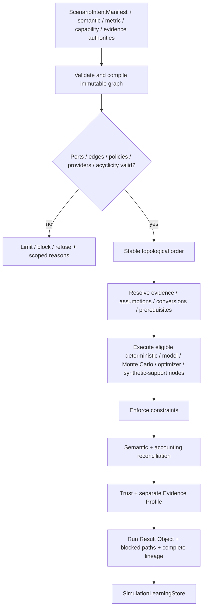

# Flow 26 — CompositeSimulationGraph Execution

```mermaid
flowchart TD
  INPUT[ScenarioIntentManifest + semantic / metric / capability / evidence authorities] --> COMPILE[Validate and compile immutable graph]
  COMPILE --> CHECK{Ports / edges / policies / providers / acyclicity valid?}
  CHECK -- no --> REFUSE[Limit / block / refuse + scoped reasons]
  CHECK -- yes --> ORDER[Stable topological order]
  ORDER --> PRE[Resolve evidence / assumptions / conversions / prerequisites]
  PRE --> EXEC[Execute eligible deterministic / model / Monte Carlo / optimizer / synthetic-support nodes]
  EXEC --> CONS[Enforce constraints]
  CONS --> REC[Semantic + accounting reconciliation]
  REC --> TE[Trust + separate Evidence Profile]
  TE --> OUT[Run Result Object + blocked paths + complete lineage]
  OUT --> MEMORY[SimulationLearningStore]
```
