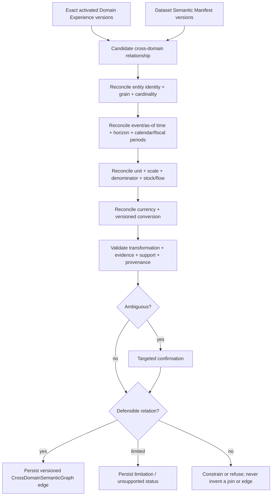

# Flow 27 — Cross-Domain Semantic Reconciliation

```mermaid
flowchart TD
  ACT[Exact activated Domain Experience versions] --> PROP[Candidate cross-domain relationship]
  MAN[Dataset Semantic Manifest versions] --> PROP
  PROP --> ENTITY[Reconcile entity identity + grain + cardinality]
  ENTITY --> TIME[Reconcile event/as-of time + horizon + calendar/fiscal periods]
  TIME --> UNIT[Reconcile unit + scale + denominator + stock/flow]
  UNIT --> CURR[Reconcile currency + versioned conversion]
  CURR --> EVID[Validate transformation + evidence + support + provenance]
  EVID --> Q{Ambiguous?}
  Q -- yes --> CONF[Targeted confirmation]
  Q -- no --> DEC{Defensible relation?}
  CONF --> DEC
  DEC -- yes --> EDGE[Persist versioned CrossDomainSemanticGraph edge]
  DEC -- limited --> LIMIT[Persist limitation / unsupported status]
  DEC -- no --> REFUSE[Constrain or refuse; never invent a join or edge]
```
