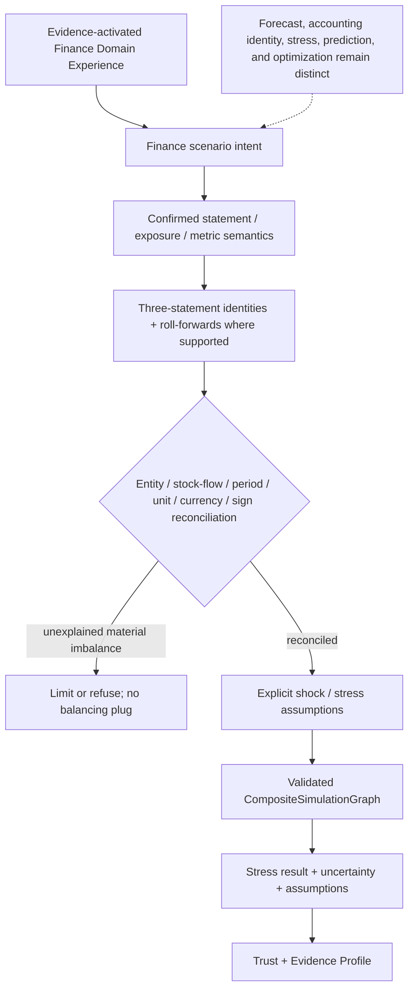

# Flow 28 — Finance Reconciliation and Stress

```mermaid
flowchart TD
  ACT[Evidence-activated Finance Domain Experience] --> INTENT[Finance scenario intent]
  INTENT --> MAP[Confirmed statement / exposure / metric semantics]
  MAP --> REC[Three-statement identities + roll-forwards where supported]
  REC --> BAL{Entity / stock-flow / period / unit / currency / sign reconciliation}
  BAL -- unexplained material imbalance --> REFUSE[Limit or refuse; no balancing plug]
  BAL -- reconciled --> STRESS[Explicit shock / stress assumptions]
  STRESS --> GRAPH[Validated CompositeSimulationGraph]
  GRAPH --> OUT[Stress result + uncertainty + assumptions]
  OUT --> TRUST[Trust + Evidence Profile]
  NOTE[Forecast, accounting identity, stress, prediction, and optimization remain distinct] -.-> INTENT
```
