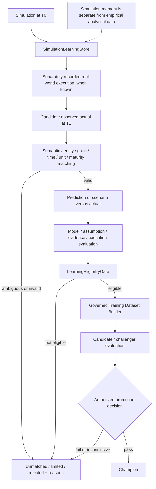

# Flow 29 — Simulation Learning and Outcome Reconciliation

```mermaid
flowchart TD
  RUN[Simulation at T0] --> STORE[SimulationLearningStore]
  STORE --> EXEC[Separately recorded real-world execution, when known]
  EXEC --> ACTUAL[Candidate observed actual at T1]
  ACTUAL --> MATCH[Semantic / entity / grain / time / unit / maturity matching]
  MATCH -->|ambiguous or invalid| HOLD[Unmatched / limited / rejected + reasons]
  MATCH -->|valid| COMP[Prediction or scenario versus actual]
  COMP --> EVAL[Model / assumption / evidence / execution evaluation]
  EVAL --> ELIG[LearningEligibilityGate]
  ELIG -->|eligible| BUILD[Governed Training Dataset Builder]
  ELIG -->|not eligible| HOLD
  BUILD --> CHAL[Candidate / challenger evaluation]
  CHAL --> PROMOTE{Authorized promotion decision}
  PROMOTE -->|pass| CHAMP[Champion]
  PROMOTE -->|fail or inconclusive| HOLD
  NOTE[Simulation memory is separate from empirical analytical data] -.-> STORE
```
