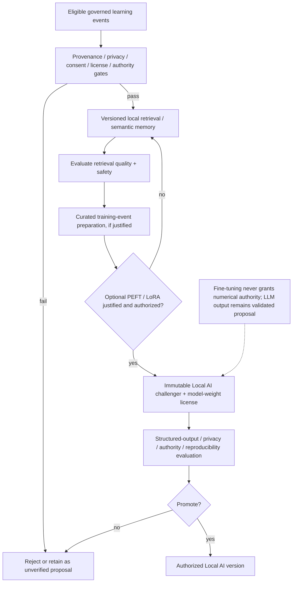

# Flow 30 — Local AI Memory and Adaptation Governance

```mermaid
flowchart TD
  EVENTS[Eligible governed learning events] --> GATE[Provenance / privacy / consent / license / authority gates]
  GATE -->|fail| REJECT[Reject or retain as unverified proposal]
  GATE -->|pass| MEMORY[Versioned local retrieval / semantic memory]
  MEMORY --> EVAL1[Evaluate retrieval quality + safety]
  EVAL1 --> CURATE[Curated training-event preparation, if justified]
  CURATE --> ADAPT{Optional PEFT / LoRA justified and authorized?}
  ADAPT -- no --> MEMORY
  ADAPT -- yes --> CHAL[Immutable Local AI challenger + model-weight license]
  CHAL --> EVAL2[Structured-output / privacy / authority / reproducibility evaluation]
  EVAL2 --> DEC{Promote?}
  DEC -- yes --> PROMOTE[Authorized Local AI version]
  DEC -- no --> REJECT
  NOTE[Fine-tuning never grants numerical authority; LLM output remains validated proposal] -.-> CHAL
```
